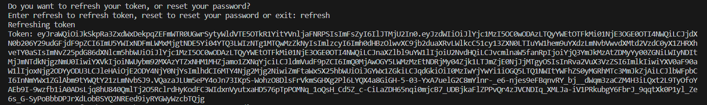
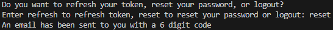
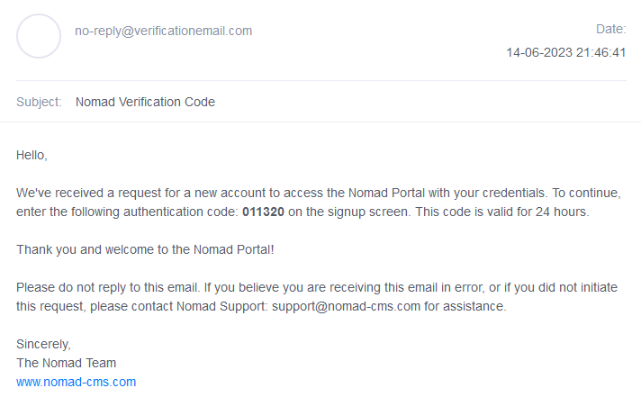
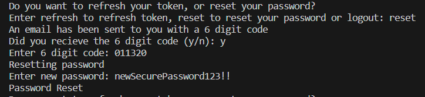
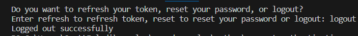

## Prerequisites

- Pip

> 📘 Note
> 
> You can download pip [here](https://pip.pypa.io/en/stable/installation/).

## Nomad SDK PIP

To learn how to download and setup the nomad sdk pip, go to [Nomad SDK PIP](https://github.com/Nomad-Media/nomad-sdk/tree/main/nomad-sdk-pip).

## Refresh Token

To refresh your token, enter "refresh" when prompted. You will then get a new token.

> 📘 Note
> 
> For more information about the API call used go to [Refreshes the authentication token.](ref:refresh)

## Forgot Password

To reset your password, enter "reset". You will then get sent an email with your new token.

> 📘 Note
> 
> For more information about the API call used go to [Forgot Password](ref:forgotpassword)

## Reset Password

If you got the 6 digit code enter "y" when prompted "Did you receive the 6 digit code (y/n)". Enter the 6 digit code and the new password you want and if you inputted the correct code, you will get a message saying that your password has reset.

If you didn't get the email enter "n" when prompted. This will send another authentication email with a new code.

> 📘 Note
> 
> For more information about the API call used go to [Reset Password](ref:resetpassword)

## Logout

To logout, enter logout at the prompt. You will receive a message stating that you successfully logged out.

> 📘 Note
> 
> For more information about the API call used go to [Logout](ref:logout-1)