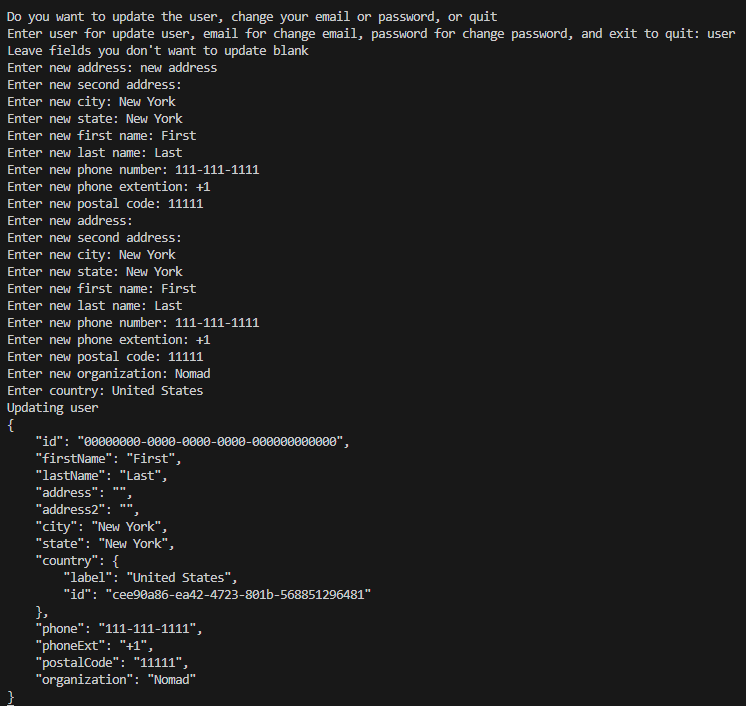
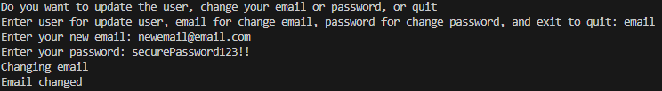
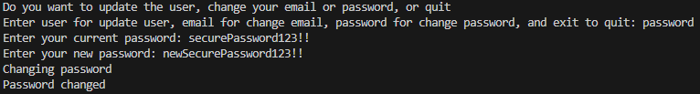

## Prerequisites

- Pip

> 📘 Note
> 
> You can download pip [here](https://pip.pypa.io/en/stable/installation/).

## Nomad SDK PIP

To learn how to download and setup the nomad sdk pip, go to [Nomad SDK PIP](https://github.com/Nomad-Media/nomad-sdk/tree/main/nomad-sdk-pip).

## User Update

To update your user, enter user. You will then be prompted for what parameters you want to update. Enter the parameters from the choices given and enter the new values for the parameters as prompted. Once you input all of your updated parameters, it will update the parameters you have chosen.

> 📘 Note
> 
> For more information about the API call used go to [Updates a user.](ref:updateuser)

## Update Email

To update your email, enter email. You will then be prompted to enter what you want to change your email to, and your password. Once you have entered those in, your email will be updated.

> 📘 Note
> 
> For more information about the API call used go to [Changes the email of a user.](ref:changeemail)

## Update Password

To update your password, enter password. You will then be prompted to enter your current password, and your new password. Once you have entered those in, your password will be updated.

> 📘 Note
> 
> For more information about the API call used go to [Changes the password of a user.](ref:changepassword)