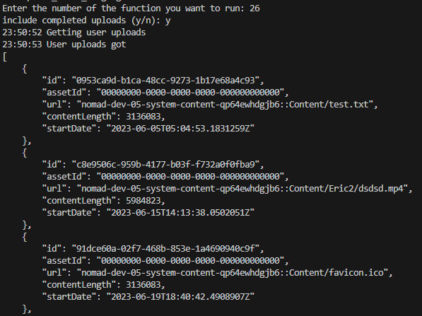

## Prerequisites

- Pip

> 📘 Note
> 
> You can download pip [here](https://pip.pypa.io/en/stable/installation/).

## Nomad SDK PIP

To learn how to download and setup the nomad sdk pip, go to [Nomad SDK PIP](https://github.com/Nomad-Media/nomad-sdk/tree/main/nomad-sdk-pip).

## Archive Asset

To archive an asset, enter 1 when prompted. Then enter the id of the asset you want to archive.

> 📘 Note
> 
> For more information about the API call used got to [Archives an asset.](ref:archiveasset)

## Clip Asset

To clip an asset, enter 3 when prompted. Then enter the id of the asset you want clipped, the start and end time code of the clip, the title of the clip, and the id of the folder where you want the clip to be saved to. Optionally, add any tags, collections, related content to the clip and the video bitrate and audio tracks.

> 📘 Note
> 
> For more information about the API call used got to [Clips an asset.](ref:clipasset)

## Copy Asset

To copy an asset, enter 4 when prompted. Then enter the id of the asset you want to copy, the id of the folder you want the asset copied to, and optionally, enter the batch action, content definition id, schema name, and whether or not to have the resolver exempt.

> 📘 Note
> 
> For more information about the API call used got to [Copies an asset.](ref:copyasset)

## Create Annotation

To create an annotation, enter 5 when prompted. Then enter the id of the asset you want annotated, the start time code, optionally the end time code, the first and second keyword, the description, the country id and description, and optionally the content id and image url.

> 📘 Note
> 
> For more information about the API call used got to [Creates an annotation.](ref:createannotation)

## Create Asset Ad Break

To create an asset ad break, enter 6 when prompted. Then enter the id of the asset you want to put the ad break in. Then optionally, enter the time code of the ad break and the tags and/or labels for the ad break.

> 📘 Note
> 
> For more information about the API call used got to [Create Asset Ad Break](doc:create-asset-ad-break)

## Create Folder Asset

To create a folder asset, enter 7 when prompted. Then enter the id of the folder you want the folder to be created in and the name of the folder.

> 📘 Note
> 
> For more information about the API call used got to [Create Folder Asset](doc:create-folder-asset)

## Create Placeholder Asset

To create a placeholder asset, enter 8 when prompted. Then enter the folder you want the asset to be created in and the name of the placeholder asset.

> 📘 Note
> 
> For more information about the API call used got to [Create Placeholder Asset](doc:create-placeholder-asset)

## Create Screenshot at Time Code

To create a screenshot at a time code, enter 9 when prompted. Then enter the id of the asset you want to create the screenshot in and the time code of the screenshot.

> 📘 Note
> 
> For more information about the API call used got to [Create Screenshot At Timecode](doc:create-screenshot-at-timecode)

## Delete Annotation

To delete an annotation, enter 10 when prompted. Then enter the id of the asset that the annotation is in and the id of the annotation.

> 📘 Note
> 
> For more information about the API call used got to [Delete Annotation](doc:delete-annotation)

## Delete Asset

To delete an asset, enter 11 when prompted. Then enter the id of the asset to be deleted.

> 📘 Note
> 
> For more information about the API call used got to [Delete Asset](doc:delete-asset)

## Delete Asset Ad Break

To delete an asset ad break, enter 12 when prompted. Then enter the id of the asset the ad break is in and the id of the ad break.

> 📘 Note
> 
> For more information about the API call used got to [Delete Asset Ad Break](doc:delete-asset-ad-break)

## Download Archive Asset

To download an archive of an asset, enter 13 when prompted. Then enter the id of the asset you want to download. If the api type is admin, you can optionally enter the file name and whether or not to download a proxy.

> 📘 Note
> 
> For more information about the API call used got to [Download Archive Asset](doc:download-archive-asset)

## Duplicate Asset

To duplicate an asset, enter 14 when prompted. Then enter the id of the asset you want to duplicate.

> 📘 Note
> 
> For more information about the API call used got to [Duplicate Asset](doc:duplicate-asset)

## Get Annotations

To get all of the annotations in an asset, enter 15 when prompted. Then enter the id of the asset that you want to get the annotations of.

> 📘 Note
> 
> For more information about the API call used got to [Get Annotations](doc:get-annotations)

## Get Asset

To get an asset, enter 16 when prompted. Then enter the id of the asset you want to get.

> 📘 Note
> 
> For more information about the API call used got to [Get Asset](doc:get-asset)

## Get Asset Ad Breaks

To get all of the asset ad breaks in an asset, enter 17 when prompted. Then enter the id of the asset that you want to get the asset ad breaks of.

> 📘 Note
> 
> For more information about the API call used got to [Get Asset Ad Break](doc:get-asset-ad-break)

## Get Asset Details

To get the details of an asset, enter 19 when prompted. Then enter the id of the asset you want to get the details of.

> 📘 Note
> 
> For more information about the API call used got to [Get Asset Details](doc:get-asset-details)

## Get Asset Manifest With Cookies

To get the asset manifest with cookies, enter 20 when prompted. Then enter the id of the the asset you want to get the cookies of and the id of the cookie.

> 📘 Note
> 
> For more information about the API call used got to [Get Asset Manifest With Cookies](doc:get-asset-manifest-with-cookies)

## Get Asset Metadata Summary

To get the metadata summary of an asset, enter 21 when prompted. Then enter the id of the asset you want to get the metadata summary of.

> 📘 Note
> 
> For more information about the API call used got to [Get Asset Metadata Summary](doc:get-asset-metadata-summary)

## Get Asset Parent Folders

To get the parent folders of an asset, enter 22 when prompted. Then enter the id of the asset you want to get the parent folders of.

> 📘 Note
> 
> For more information about the API call used got to [Get Asset Parent Folders](doc:get-asset-parent-folders)

## Get User Upload Parts

To get the parts of a user upload, enter 25 when prompted. Then enter the id of the user upload you want to get the parts of.

> 📘 Note
> 
> For more information about the API call used got to [Get User Upload Parts](doc:get-user-upload-parts)

## Get User Uploads

To get the uploads of a user, enter 26 when prompted. Then enter whether or not you want to include completed uploads.

> 📘 Note
> 
> For more information about the API call used got to [Get User Uploads](doc:get-user-uploads)

## Import Annotations

To import annotations, enter 27 when prompted. Then enter the id of the asset you want to import the annotations of and the start and end time code of the annotation. Then optionally, you can add more annotations.

> 📘 Note
> 
> For more information about the API call used got to [Import Annotation](doc:import-annotation)

## Index Asset

To index an asset, enter 28 when prompted. Then enter the id of the asset you want to index.

> 📘 Note
> 
> For more information about the API call used got to [Index Asset](doc:index-asset)

## Move Asset

To move an asset, enter 30 when prompted. Then enter the id of the asset you want to move, and the id of the folder you want to move the asset to.

> 📘 Note
> 
> For more information about the API call used got to [Move Asset](doc:move-asset)

## Record Asset Tracking Beacon

To record an asset tracking beacon, enter 31 when prompted. Then enter the id of the asset you want to get the recording tracking beacon of, the tracking event of the beacon, the id of the content and live channel, and the seconds.

> 📘 Note
> 
> For more information about the API call used got to [Record Asset Tracking Beacon](doc:record-asset-tracking-beacon)

## Reprocess Asset

To reprocess an asset, enter 33 when prompted. Then enter the ids of the asset you want to reprocess.

> 📘 Note
> 
> For more information about the API call used got to [Reprocess Asset](doc:reprocess-asset)

## Restore Asset

To restore an asset, enter 34 when prompted. Then enter the id of the asset you want to restore.

> 📘 Note
> 
> For more information about the API call used got to [Restore Asset](doc:restore-asset)

## Share Asset

To share an asset, enter 35 when prompted. Then enter the id of the asset you want to share, the id(s) of the nomad and/or external users you want to share the asset with, and the duration you want to share the asset for.

> 📘 Note
> 
> For more information about the API call used got to [Share Asset](doc:share-asset)

## Start Workflow

To start a workflow, enter 36 when prompted. Then enter the key value for the action argument and the id(s) you want to start the workflow of.

> 📘 Note
> 
> For more information about the API call used got to [Start Workflow](doc:start-workflow)

## Update Annotation

To update an annotation, enter 38 when prompted. Then enter the id of the asset the annotation is in and the id of the annotation.

> 📘 Note
> 
> For more information about the API call used got to [Update Annotation](doc:update-annotation)

## Update Asset

To update an asset, enter 39 when prompted. Then enter the id of the asset you want to update and the display name, display date, available start date, available end date, and/or any additional properties you want to update. 

> 📘 Note
> 
> For more information about the API call used got to [Update Asset](doc:update-asset)

## Update Asset Ad Break

To update an asset ad break, enter 40 when prompted. Then enter the id of the asset the ad break to be updated is in and the id of the asset ad break.

> 📘 Note
> 
> For more information about the API call used got to [Update Asset Ad Break](doc:update-asset-ad-break)

## Update Asset Language

To update an asset's language, enter 41 when prompted. Then enter the id of the asset you want to update the asset of and the id of the language you want to change the asset's language to.

> 📘 Note
> 
> For more information about the API call used got to [Update Asset Language](doc:update-asset-language)