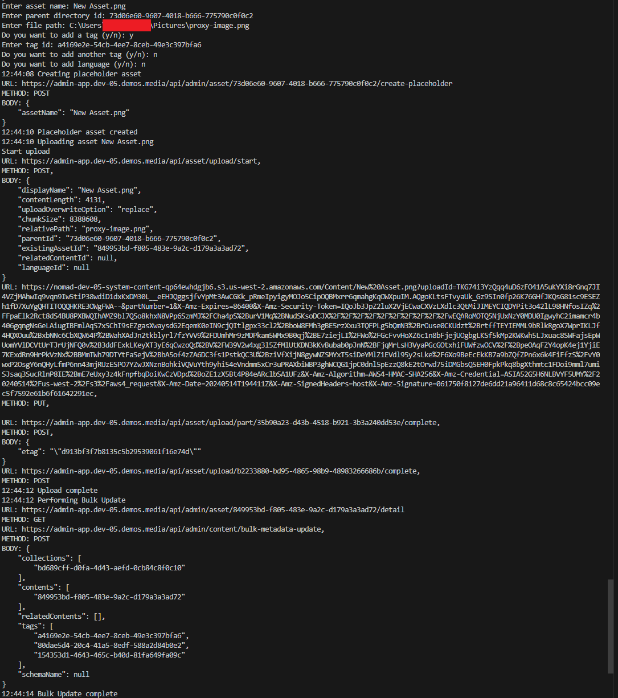

## Prerequisites

- Pip

> 📘 Note
> 
> You can download pip [here](https://pip.pypa.io/en/stable/installation/).

## Nomad SDK PIP

To learn how to download and setup the nomad sdk pip, go to [Nomad SDK PIP](https://github.com/Nomad-Media/nomad-sdk/tree/main/nomad-sdk-pip).

## Asset External Upload

To upload an asset externally, enter the name, with extension, of the asset you want to upload. Then enter the id of the parent directory you want to upload the asset to, the file you want to upload, the ids of the tags you want to add to the asset, and the language id of the asset.

> 📘 Note
>
> For more information on the API calls used go to [Upload Asset](https://developer.nomad-cms.com/docs/upload-asset-sdk) [Create Placeholder](https://developer.nomad-cms.com/docs/create-placeholder-asset) [Search](https://developer.nomad-cms.com/docs/search-api).