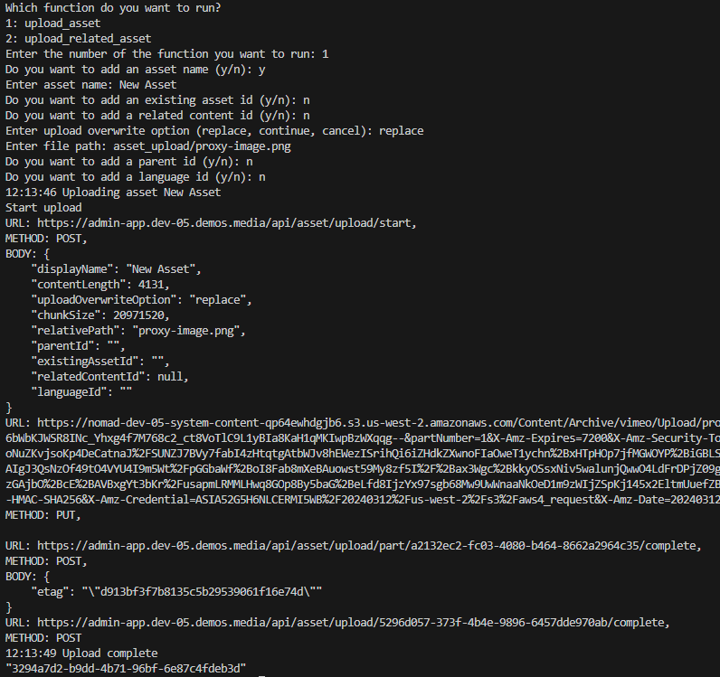
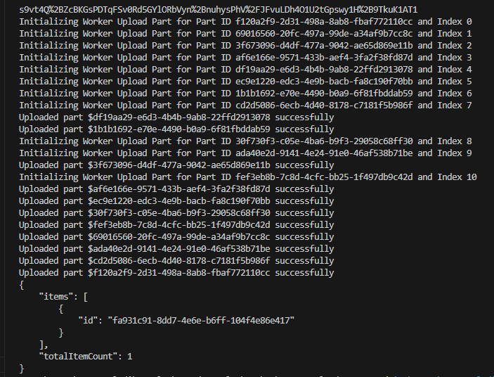

## Prerequisites

- Pip

> 📘 Note
> 
> You can download pip [here](https://pip.pypa.io/en/stable/installation/).

## Nomad SDK PIP

To learn how to download and setup the nomad sdk pip, go to [Nomad SDK PIP](https://github.com/Nomad-Media/nomad-sdk/tree/main/nomad-sdk-pip).

## Upload File

To upload a file, first enter the display name for your asset. If you leave it blank, it will default to the name of your file. Then, enter the upload overwrite option you want to select. Replace replaces an existing asset, continue continues the upload of an asset that is currently uploading, and cancel cancels the upload of an asset that is uploading. Then, enter the file path, related content id you want to add to the asset, and whether or not you want to use multi-thread upload.

> 📘 Note
> 
> For more information about the API calls used go to [Asset Upload](ref:asset-upload)