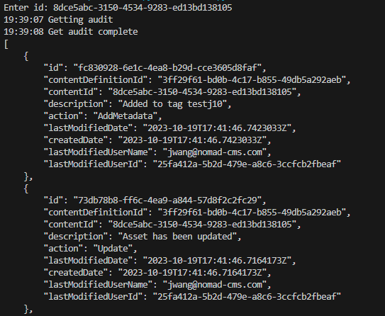

## Prerequisites

- Pip

> 📘 Note
> 
> You can download pip [here](https://pip.pypa.io/en/stable/installation/).

## Nomad SDK PIP

To learn how to download and setup the nomad sdk pip, go to [Nomad SDK PIP](https://github.com/Nomad-Media/nomad-sdk/tree/main/nomad-sdk-pip).

## Get Audit

To get an audit, enter the id of the content you want to get an audit of.

> 📘 Note
> 
> For more information about the API calls used go to [Gets the audit.](ref:getaudit)