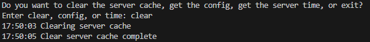
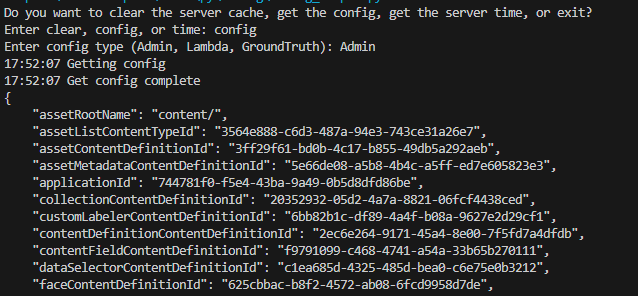
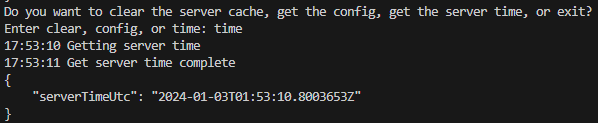

## Prerequisites

- Pip

> 📘 Note
> 
> You can download pip [here](https://pip.pypa.io/en/stable/installation/).

## Nomad SDK PIP

To learn how to download and setup the nomad sdk pip, go to [Nomad SDK PIP](https://github.com/Nomad-Media/nomad-sdk/tree/main/nomad-sdk-pip).

## Clear Server Cache

To clear the server cache, enter clear when prompted.

> 📘 Note
> 
> For more information about the API calls used go to  [Clear Server Cache](https://developer.nomad-cms.com/docs/clear-server-cache)

## Get Config

To get the current config enter config when prompted. Then enter the type of config you want to retrieve.

> 📘 Note
> 
> For more information about the API calls used go to [Get Config](https://developer.nomad-cms.com/docs/get-config)

## Get Server Time

To get the current server time, enter time when prompted.

> 📘 Note
> 
> For more information about the API calls used go to [Get Server Time](https://developer.nomad-cms.com/docs/get-server-time)