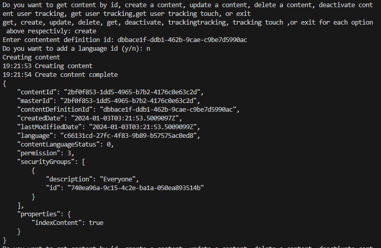
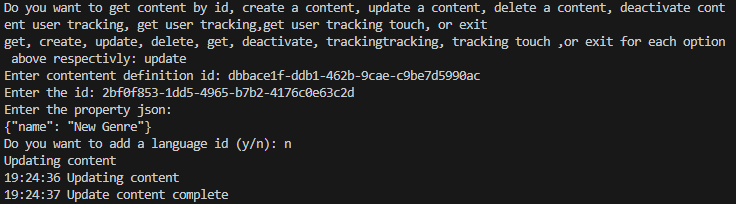
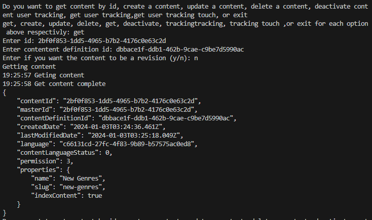
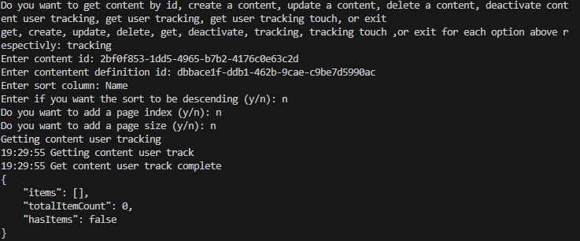
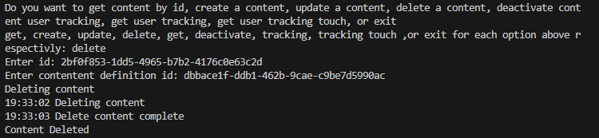

## Prerequisites

- Pip

> 📘 Note
> 
> You can download pip [here](https://pip.pypa.io/en/stable/installation/).

## Nomad SDK PIP

To learn how to download and setup the nomad sdk pip, go to [Nomad SDK PIP](https://github.com/Nomad-Media/nomad-sdk/tree/main/nomad-sdk-pip).

## Create Content

To create content, enter create when prompted. Then enter the content definition id you want to create the content in. This will create a new blank content in your content definition.

> 📘 Note
> 
> For more information about the API calls used go to [Create Content](https://developer.nomad-cms.com/docs/create-content)

## Update Content

To add/update information to your content, enter update when prompted. Then enter the content definition id of the content you want to update, the id of the content you want to update, and the fields you want to update.

> 📘 Note
> 
> For more information about the API calls used go to [Update Content](https://developer.nomad-cms.com/docs/update-content)

## Get Content

To get content enter get when prompted. Then enter the id and content definition id of the content you want to get.

> 📘 Note
> 
> For more information about the API calls used go to [Get Content](https://developer.nomad-cms.com/docs/get-content)

## Get User Tracking

To get user tracking, enter tracking when prompted. Then enter the id and content definition id of the content you want to get the user tracking of.

> 📘 Note
> 
> For more information about the API calls used go to [Get Content User Tracking](https://developer.nomad-cms.com/docs/get-content-user-track)

## Delete Content

To delete content, enter delete when prompted. Then enter the content definition id of the content you want to delete and the id of the content you want to delete.

> 📘 Note
> 
> For more information about the API calls used go to [Delete Content](https://developer.nomad-cms.com/docs/delete-content)