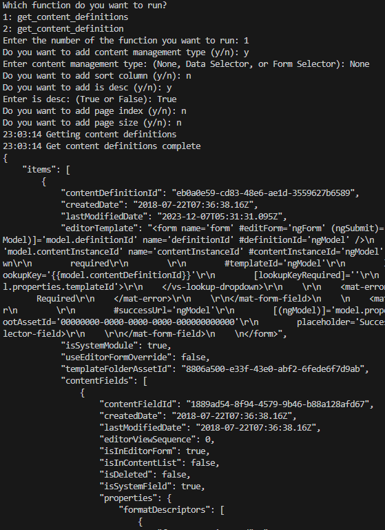
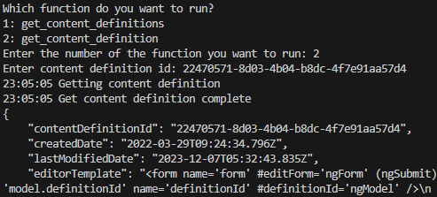

## Prerequisites

- Pip

> 📘 Note
> 
> You can download pip [here](https://pip.pypa.io/en/stable/installation/).

## Nomad SDK PIP

To learn how to download and setup the nomad sdk pip, go to [Nomad SDK PIP](https://github.com/Nomad-Media/nomad-sdk/tree/main/nomad-sdk-pip).

## Get Content Definitions

To get all content definitions, enter the content management type, sort column, is descending, page index and page size. Then click the `Get Content Definitions` button.

> 📘 Note
>
> For more information on the API calls used go to [Get Content Definitions](https://developer.nomad-cms.com/docs/get-content-definitions).

## Get Content Definition

To get a content definition, enter the content definition id and click the `Get Content Definition` button.

> 📘 Note
>
> For more information on the API calls used go to [Get Content Definition](https://developer.nomad-cms.com/docs/get-content-definition).