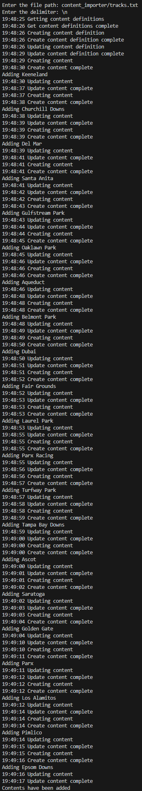

## Prerequisites

- Pip

> 📘 Note
> 
> You can download pip [here](https://pip.pypa.io/en/stable/installation/).

## Nomad SDK PIP

To learn how to download and setup the nomad sdk pip, go to [Nomad SDK PIP](https://github.com/Nomad-Media/nomad-sdk/tree/main/nomad-sdk-pip).

## Content Importer

To use the content importer, enter the file path of the content you want to import. Then enter the delimiter of the content you are importing. The content importer will then import the content into the database. 

> 📘 Note
>
> You must be an admin to use the content importer.