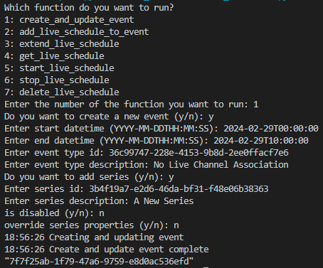
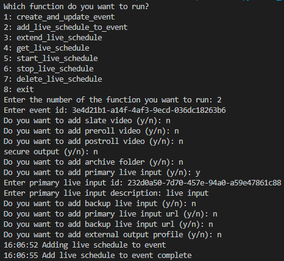
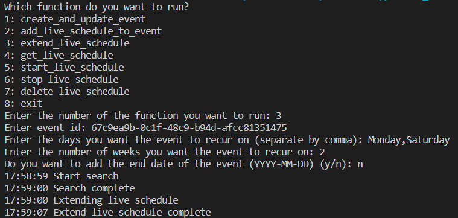
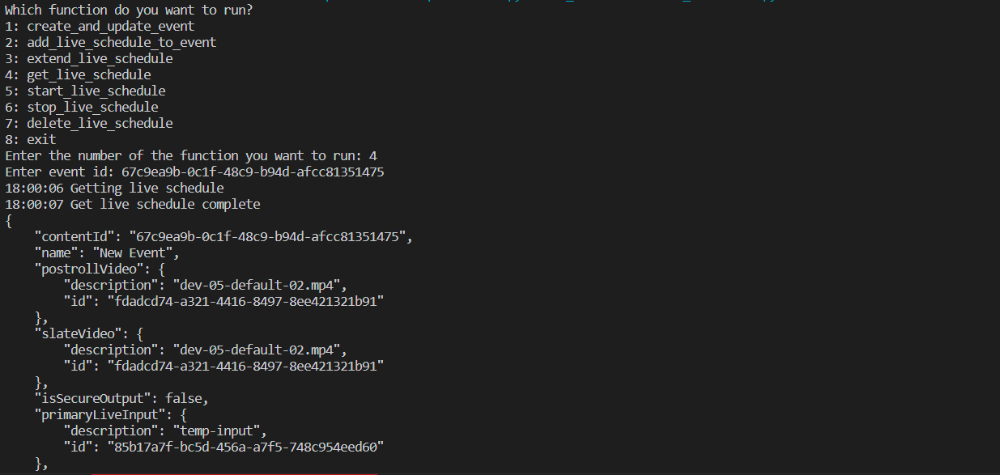
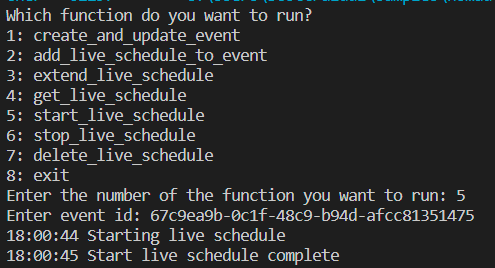
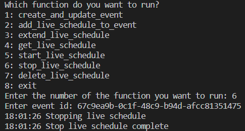
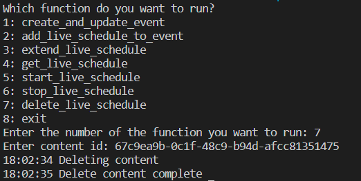

## Prerequisites

- Pip

> 📘 Note
> 
> You can download pip [here](https://pip.pypa.io/en/stable/installation/).

## Nomad SDK PIP

To learn how to download and setup the nomad sdk pip, go to [Nomad SDK PIP](https://github.com/Nomad-Media/nomad-sdk/tree/main/nomad-sdk-pip).

## Create and Update Event Instance

To create or update an event, enter 1 when prompted. Then first select whether you want to create or update an event. Then enter the name you want to assign the event, the start and end date-time of the event, and any additional properties.

> 📘 Note
> 
> For more information about the API calls used go to [Creates and updates an event.](ref:createandupdateevent)

## Add Live Schedule To Event

To add a live schedule to an event, enter 2 when prompted. Then enter the id of the event you want to add the live schedule to. Next, fill out the rest of the information. Either the Primary Livestream Input, or the Primary Livesteam Input URL is required.

> 📘 Note
> 
> For more information about the API calls used go to [Adds a live schedule to an event.](ref:addlivescheduletoevent)

## Extend Live Schedule

To extend a Live Schedule, enter 3 when prompted. Then enter the id of the event with the live schedule, the days you want to extend it to, and the number of weeks you want to extend the live schedule to. Optionally, you can include the datetime in which you want to end the extension.

> 📘 Note
> 
> For more information about the API calls used go to [Extends a live schedule.](ref:extendliveschedule)

## Get Live Schedule

To get a live schedule of an event, you need to enter the id of the event.

> 📘 Note
> 
> For more information about the API calls used go to [Gets a live schedule.](ref:getliveschedule)

## Start Live Schedule

To start a live schedule of an event, you need to enter the id of the event.

> 📘 Note
> 
> For more information about the API calls used go to [Starts a live schedule.](ref:startliveschedule)

## Stop Live Schedule

To stop a live schedule of an event, you need to enter the id of the event.

> 📘 Note
> 
> For more information about the API calls used go to [Stops a live schedule.](ref:stopliveschedule)

## Deleting Event Instance

To delete an instance, you need the content id, and the content definition id.

> 📘 Note
> 
> For more information about the API calls used go to [Deletes an event.](ref:deleteevent)