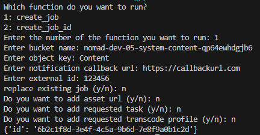
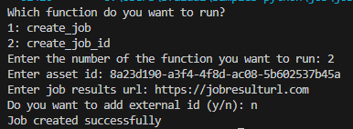

## Prerequisites

- Pip

> 📘 Note
> 
> You can download pip [here](https://pip.pypa.io/en/stable/installation/).

## Nomad SDK PIP

To learn how to download and setup the nomad sdk pip, go to [Nomad SDK PIP](https://github.com/Nomad-Media/nomad-sdk/tree/main/nomad-sdk-pip).

## Create Job

To create a job, enter 1 when prompted. Then enter the bucket name, object key, notification callback url, and external id that you want to assign the job. Optionally, enter the asset url, requested tasks and requested transcode profile.

> 📘 Note
> 
> For more information about the API call used go to [Add Tag or Collection](https://developer.nomad-cms.com/docs/create-job)

## Create Job Id

To create a job for an asset, enter 2 when prompted. Then enter the asset id and job result url you want to assign to the job. Optionally, enter the external id.

> 📘 Note
> 
> For more information about the API call used go to [Add Tag or Collection](https://developer.nomad-cms.com/docs/create-job-id)