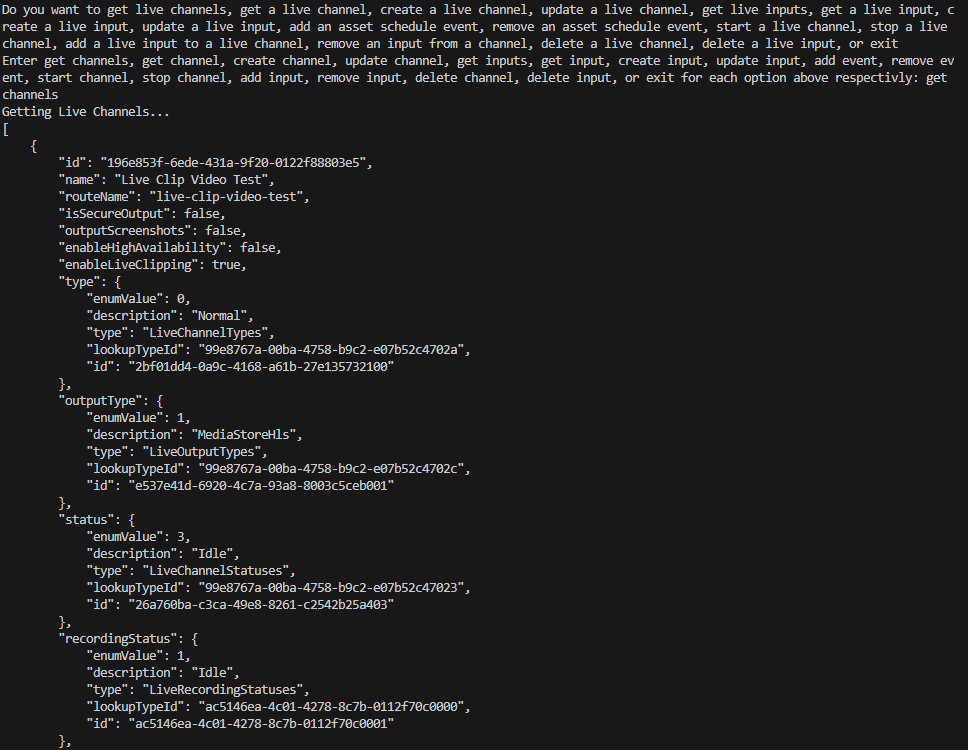
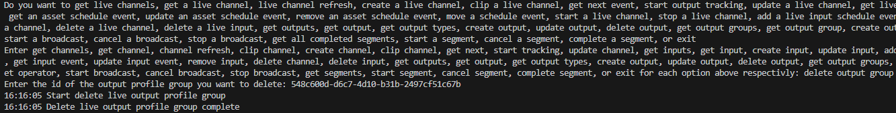

## Prerequisites

- Pip

> 📘 Note
> 
> You can download pip [here](https://pip.pypa.io/en/stable/installation/).

## Nomad SDK PIP

To learn how to download and setup the nomad sdk pip, go to [Nomad SDK PIP](https://github.com/Nomad-Media/nomad-sdk/tree/main/nomad-sdk-pip).

## Get Live Channels

To get all live channels, enter get channels into the prompt.

> 📘 Note
> 
> For more information about the API call used go to [Get Live Channels](https://developer.nomad-cms.com/docs/get-live-channels)

## Get Live Channel

To get a live channel enter get channel into the prompt. Then enter the id of the channel you want to get.

> 📘 Note
> 
> For more information about the API call used go to [Get Live Channel](https://developer.nomad-cms.com/docs/get-live-channel)

## Live Channel Refresh

To refresh all live channels enter channel refresh when prompted.

> 📘 Note
> 
> For more information about the API call used go to [Refresh Live Channels](https://developer.nomad-cms.com/docs/refresh-live-channels)

## Create Live Channel

To create a live channel, enter create channel into the prompt. Then enter the name, folder archive id, high availability, live clipping, secure output, output screenshots, and channel type.

> 📘 Note
> 
> For more information about the API call used go to [Create Live Channel](https://developer.nomad-cms.com/docs/create-live-channel)

## Clip Live Channel

To clip a live channel enter clip channel into the prompt. Then enter the id of the channel you want to clip and the rest of the data you want to set for the clip.

> 📘 Note
> 
> For more information about the API call used go to [Clip Live Channel](https://developer.nomad-cms.com/docs/clip-live-channel)

## Next Event

To get the next event of a channel, enter get next into the prompt. Then enter the id of the event you want to get the next event of.

> 📘 Note
> 
> For more information about the API call used go to [Get Next Event](https://developer.nomad-cms.com/docs/get-next-event)

## Start Output Tracking

To start output tracking, enter start tracking into the prompt, Then enter the id of the channel you want to start the output tracking of.

> 📘 Note
> 
> For more information about the API call used go to [Start Output Tracking](https://developer.nomad-cms.com/docs/start-output-tracking)

## Update Live Channel

To update a live channel, enter update channel into the prompt. Then enter the id of the channel of the channel you want to update. Then enter the name, folder archive id, high availability, live clipping, secure output, output screenshots, and channel type you want to update.

> 📘 Note
> 
> For more information about the API call used go to [Update Live Channel](https://developer.nomad-cms.com/docs/update-live-channel)

## Start Live Channel

To start a live channel, enter start channel into the prompt. Then enter the id of the channel you want to start.

> 📘 Note
> 
> For more information about the API call used go to [Start Live Channel](https://developer.nomad-cms.com/docs/start-live-channel)

## Stop Live Channel

To stop a live channel, enter stop channel into the prompt. Then enter the id of the channel you want to stop.

> 📘 Note
> 
> For more information about the API call used go to [Stop Live Channel](https://developer.nomad-cms.com/docs/stop-live-channel)

## Delete Live Channel

To delete a live channel, enter delete channel when prompted. Then enter the channel id and if you want to delete the live inputs attached to the live channel.

> 📘 Note
> 
> For more information about the API call used go to [Delete Live Channel](https://developer.nomad-cms.com/docs/delete-live-channel)

## Add Asset Schedule Event

To add an asset schedule event to a channel, enter add event into the prompt. Then enter the id of the channel you want to add the asset schedule event to and the id of the asset you want to add to the channel.

> 📘 Note
> 
> For more information about the API call used go to [Add Asset Schedule Event](https://developer.nomad-cms.com/docs/add-asset-schedule-event)

## Get Asset Schedule Event

To get an asset schedule event, enter get event into the prompt. Then enter the id of the channel that the asset schedule event is in and the id of the asset schedule event.

> 📘 Note
> 
> For more information about the API call used go to [Get Asset Schedule Event](https://developer.nomad-cms.com/docs/get-asset-schedule-event)

## Update Asset Schedule Event

To update an asset schedule event, enter update event when prompted. Then enter the id of the channel that the asset schedule event is in and the id of the asset schedule event. Then enter the data you want to update.

> 📘 Note
> 
> For more information about the API call used go to [Update Asset Schedule Event](https://developer.nomad-cms.com/docs/update-asset-schedule-event)

## Remove Asset Schedule Event

To remove an asset schedule event, enter remove event into the prompt. Then enter the id of the channel you want to remove the asset channel from and the id of the asset schedule event you want to remove from the channel.

> 📘 Note
> 
> For more information about the API call used go to [Remove Asset Schedule Event](https://developer.nomad-cms.com/docs/remove-asset-schedule-event)

## Move Schedule Event

> 📘 Note
> 
> For more information about the API call used go to [Move Schedule Event](https://developer.nomad-cms.com/docs/move-schedule-event)

## Get Live Inputs

To get all live input, enter get inputs into the prompt.

> 📘 Note
> 
> For more information about the API call used go to [Gets Live Inputs](https://developer.nomad-cms.com/docs/get-live-inputs)

## Get Live Input

To get a live input, enter get input into the prompt. Then enter the id of the input you want to get.

> 📘 Note
> 
> For more information about the API call used go to [Get Live Input](https://developer.nomad-cms.com/docs/get-live-input)

## Create Live Input

To create a live input, enter create input when prompted. Then enter the name you want to assign the input and the input type. If the input type is RTMP_PULL, RTP_PUSH, or URL_PULL, you will be asked for a source. If the input type is RTMP_PUSH, you will be asked for a source cidr.

> 📘 Note
> 
> For more information about the API call used go to [Create Live Input](https://developer.nomad-cms.com/docs/create-live-input)

## Updating Live Input

To update a live input enter update input into the prompt. Then enter the id of the input you want to update, the updated name, and the updated type. If the input type is RTMP_PULL, RTP_PUSH, or URL_PULL, you will be asked for a source. If the input type is RTMP_PUSH, you will be asked for a source cidr. If you don't want to update a parameter, leave it blank and press enter on the prompt.

> 📘 Note
> 
> For more information about the API call used go to [Update Live Input](https://developer.nomad-cms.com/docs/update-live-input)

## Add Live Input Schedule Event

To add a live input to a live channel, enter add input into the prompt. Then enter the channel id you want to add the input to, the input id, and if you want to have a fixed on air time, the on air time in UTC.

> 📘 Note
> 
> For more information about the API call used go to [Add Input Schedule Event](https://developer.nomad-cms.com/docs/add-input-schedule-event)

## Get Live Input Schedule Event

To get a live input schedule event, enter get input event when prompted. Then enter the id of the channel the input schedule event is in and the id of the input Schedule Event

> 📘 Note
> 
> For more information about the API call used go to  [Get Input Schedule Event](https://developer.nomad-cms.com/docs/get-input-schedule-event)

## Update Live Input Schedule Event

To update a live input schedule event, enter update input event when prompted. Then enter the id of the channel the input schedule event is in and the id of the input Schedule Event Then enter the data you want to update.

> 📘 Note
> 
> For more information about the API call used go to [Update Input Schedule Event](https://developer.nomad-cms.com/docs/update-input-schedule-event)

## Remove Live Input Schedule Event

To remove a live input schedule event, enter remove input when prompted. Then enter the id of the channel the input schedule event is in and the id of the input schedule event.

> 📘 Note
> 
> For more information about the API call used go to [Remove Input Schedule Event](https://developer.nomad-cms.com/docs/remove-input-schedule-event)

## Delete Live Input

To delete a live input, enter delete input when prompted. Then enter the id of the input you want to delete.

> 📘 Note
> 
> For more information about the API call used go to [Delete Live Input](https://developer.nomad-cms.com/docs/delete-live-input)

## Get Live Output Profiles

To get all live output profiles, enter get outputs into the prompt.

> 📘 Note
>
> For more information about the API call used go to [Gets Live Outputs](https://developer.nomad-cms.com/docs/get-live-outputs)

## Get Live Output Profile

To get a live output profile, enter get output into the prompt. Then enter the id of the output you want to get.

> 📘 Note
>
> For more information about the API call used go to [Get Live Output](https://developer.nomad-cms.com/docs/get-live-output)

## Get Live Output Types

To get all live output types, enter get output types into the prompt.

> 📘 Note
>
> For more information about the API call used go to [Get Live Output Types](https://developer.nomad-cms.com/docs/get-live-output-types)

## Create Live Output Profile

To create a live output profile, enter create output when prompted. Then enter the name of the output, choose an output type, and select if the output is active or not. Then, optionally, enter the rest of the information you want to add when prompted.

> 📘 Note
>
> For more information about the API call used go to [Create Live Output](https://developer.nomad-cms.com/docs/create-live-output)

## Update Live Output Profile

To udpate a live output profile, enter update output when prompted. Then fill in the rest of the information you want to update.

> 📘 Note
>
> For more information about the API call used go to [Update Live Output](https://developer.nomad-cms.com/docs/update-live-output)

## Delete Live Output Profile

To delete a live output profile, enter delete output when prompted. Then enter the id of the output you want to delete.

> 📘 Note
>
> For more information about the API call used go to [Delete Live Output](https://developer.nomad-cms.com/docs/delete-live-output)

## Get Live Output Profile Groups

To get all live output profile groups, enter get output groups into the prompt.

> 📘 Note
>
> For more information about the API call used go to [Get Live Output Groups](https://developer.nomad-cms.com/docs/get-live-output-groups)

## Get Live Output Profile Group

To get a live output profile group, enter get output group when prompted. Then enter the id of the output group you want to get.

> 📘 Note
>
> For more information about the API call used go to [Get Live Output Group](https://developer.nomad-cms.com/docs/get-live-output-group)

## Create Live Output Profile Group

To create a live output profile group, enter create output group when prompted. Then enter the name of the output group, whether or not to enable the group, the manifest type, whether or not to make the group the default group, optionally, the archive live output profile id, and the output ids you want to add to the group.

> 📘 Note
>
> For more information about the API call used go to [Create Live Output Group](https://developer.nomad-cms.com/docs/create-live-output-group)

## Update Live Output Profile Group

To update a live output profile group, enter update output group when prompted. Then enter the id of the output group you want to update and the rest of the information you want to update.

> 📘 Note
>
> For more information about the API call used go to [Update Live Output Group](https://developer.nomad-cms.com/docs/update-live-output-group)

## Delete Live Output Profile Group

To delete a live output profile group, enter delete output group when prompted. Then enter the id of the output group you want to delete.

> 📘 Note
>
> For more information about the API call used go to [Delete Live Output Group](https://developer.nomad-cms.com/docs/delete-live-output-group)

## Get Live Operators

To get all live operators, enter get operators into the prompt.

> 📘 Note
> 
> For more information about the API call used go to [Get Live Operators](https://developer.nomad-cms.com/docs/get-live-operators)

## Get Live Operator

To get a specific live operator, enter get operator into the prompt. Then enter the id of the channel you want to get the live operator of.

> 📘 Note
> 
> For more information about the API call used go to [Get Live Operator](https://developer.nomad-cms.com/docs/get-live-operator)

## Start Broadcast

To start a broadcast, enter start broadcast when prompted. Then enter the id of the channel you want to use for the broadcast. Then enter the preroll and postroll asset id, live input id, related content ids, and tag ids if you want to add them.

> 📘 Note
> 
> For more information about the API call used go to [Start Broadcast](https://developer.nomad-cms.com/docs/start-broadcast)

## Cancel Broadcast

To cancel a broadcast, enter cancel broadcast when prompted. Then enter the id of the channel associated with the broadcast.

> 📘 Note
> 
> For more information about the API call used go to [Cancel Broadcast](https://developer.nomad-cms.com/docs/cancel-broadcast)

## Stop Broadcast

To stop a broadcast, enter stop broadcast when prompted. Then enter the id of the channel associated with the broadcast.

> 📘 Note
> 
> For more information about the API call used go to [Stop Broadcast](https://developer.nomad-cms.com/docs/stop-broadcast)

## Get Completed Segments

To get all completed segments, enter get segments when prompted. Then enter the id of the channel associated with the broadcast the segments are in. 

> 📘 Note
> 
> For more information about the API call used go to [Get Complete Segments](https://developer.nomad-cms.com/docs/get-complete-segments)

## Start Segment

To start a segment, enter start segment when prompted. Then enter the id of the channel associated with the broadcast that you want to start the segment in.

> 📘 Note
> 
> For more information about the API call used go to [Start Segment](https://developer.nomad-cms.com/docs/start-segment)

## Cancel Segment

To cancel a segment, enter cancel segment when prompted. Then enter the id of the channel associated with the broadcast that you want to cancel the segment from.

> 📘 Note
> 
> For more information about the API call used go to [Cancel Segment](https://developer.nomad-cms.com/docs/cancel-segment)

## Complete Segment

To complete a segment, enter complete segment when prompted. Then enter the ids of the related contents and tags you want to add to the segment.

> 📘 Note
> 
> For more information about the API call used go to [Complete Segment](https://developer.nomad-cms.com/docs/complete-segment)