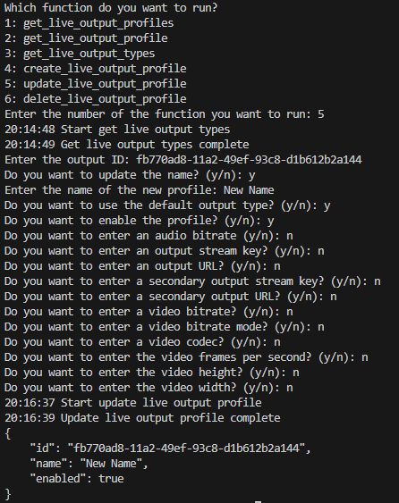

## Prerequisites

- Pip

> 📘 Note
> 
> You can download pip [here](https://pip.pypa.io/en/stable/installation/).

## Nomad SDK PIP

To learn how to download and setup the nomad sdk pip, go to [Nomad SDK PIP](https://github.com/Nomad-Media/nomad-sdk/tree/main/nomad-sdk-pip).

## Get Live Output Profiles

To get all live output profiles, enter 1 when prompted.

> 📘 Note
>
> For more information about the API call used go to [Gets live output profiles](https://developer.nomad-cms.com/docs/get-live-output-profiles)

## Get Live Output Profile

To get a live output profile, enter 2 when prompted. Then enter the id of the live output profile you want to get.

> 📘 Note
>
> For more information about the API call used go to [Gets a live output profile](https://developer.nomad-cms.com/docs/get-live-output-profile)

## Get Live Output Types

To get all live output types, enter 3 when prompted.

> 📘 Note
>
> For more information about the API call used go to [Gets live output types](https://developer.nomad-cms.com/docs/get-live-output-types)

## Create Live Output Profile

To create a live output profile, enter 4 when prompted. Then enter the name of the live output profile you want to create. Then enter the rest of the information you want to add to your live output profile.

> 📘 Note
>
> For more information about the API call used go to [Creates a live output profile](https://developer.nomad-cms.com/docs/create-live-output-profile)

## Update Live Output Profile

To update a live output profile, enter 5 when prompted. Then enter the id of the live output profile you want to update. Then enter the rest of the information you want to update in your live output profile.

> 📘 Note
>
> For more information about the API call used go to [Updates a live output profile](https://developer.nomad-cms.com/docs/update-live-output-profile)

## Delete Live Output Profile

To delete a live output profile, enter 6 when prompted. Then enter the id of the live output profile you want to delete.

> 📘 Note
>
> For more information about the API call used go to [Deletes a live output profile](https://developer.nomad-cms.com/docs/delete-live-output-profile)