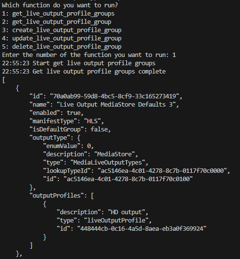
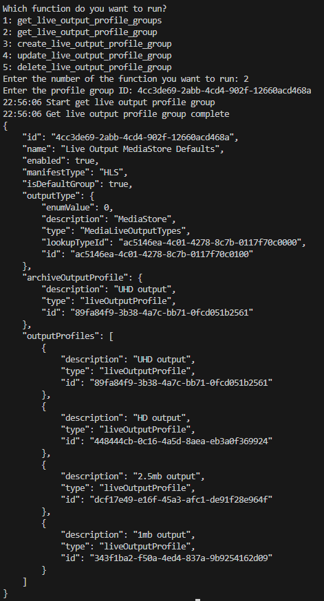
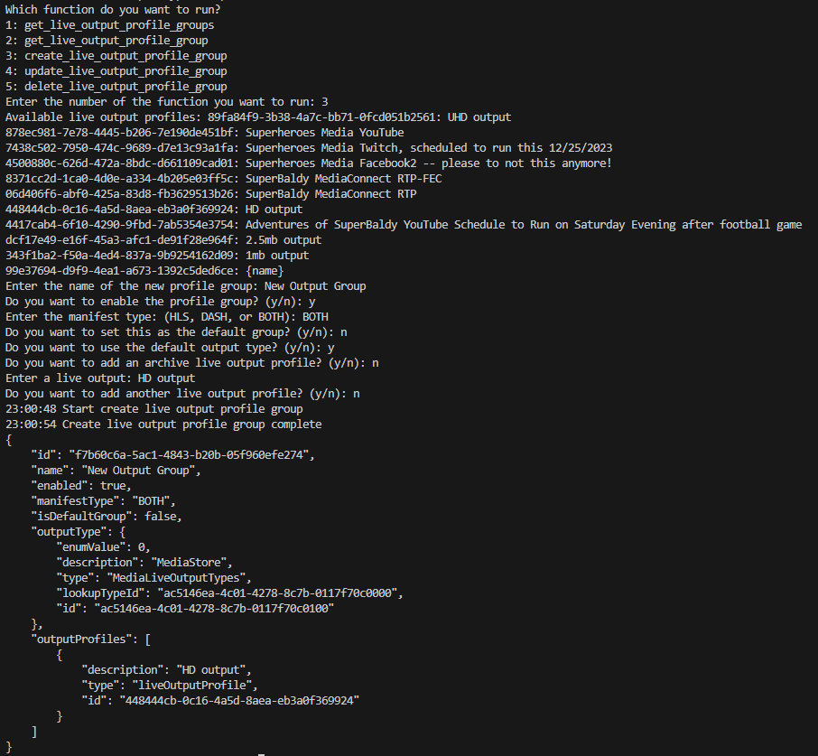
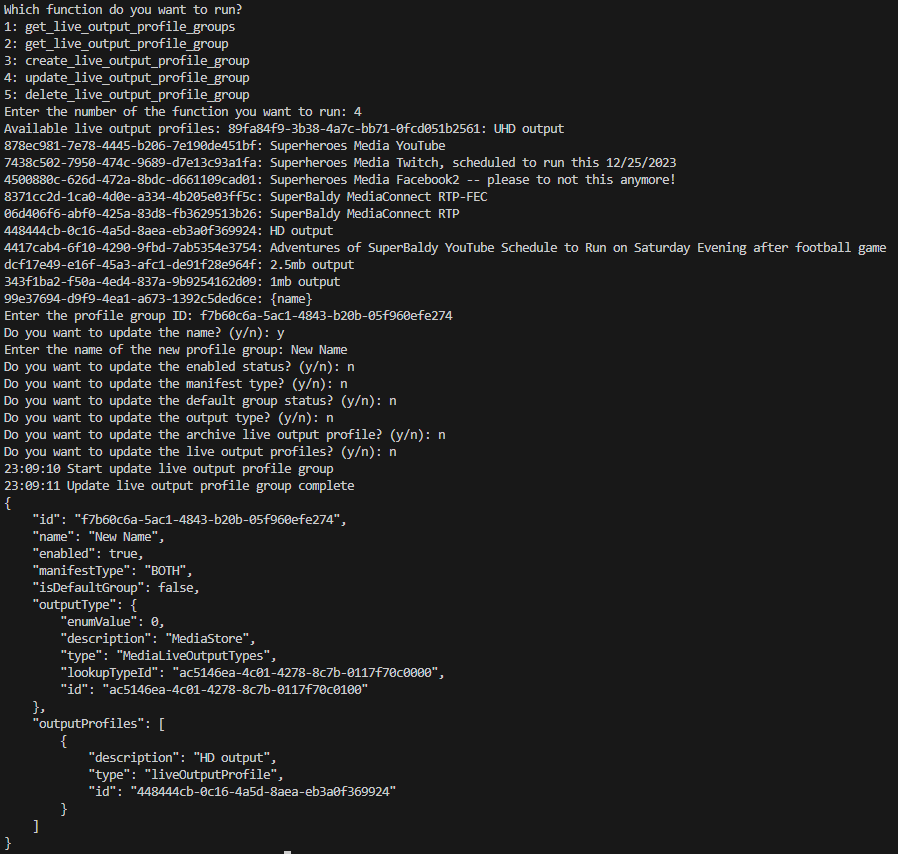
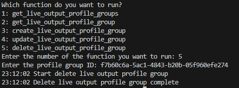

## Prerequisites

- Pip

> 📘 Note
> 
> You can download pip [here](https://pip.pypa.io/en/stable/installation/).

## Nomad SDK PIP

To learn how to download and setup the nomad sdk pip, go to [Nomad SDK PIP](https://github.com/Nomad-Media/nomad-sdk/tree/main/nomad-sdk-pip).

## Get Live Output Profile Groups

To get all live output profile groups, enter 1 when prompted.

> 📘 Note
>
> For more information about the API call used go to [Gets live output profile groups](https://developer.nomad-cms.com/docs/get-live-output-profile-groups)

## Get Live Output Profile Group

To get a live output profile group, enter 2 when prompted. Then enter the id of the live output profile group you want to get.

> 📘 Note
>
> For more information about the API call used go to [Gets a live output profile group](https://developer.nomad-cms.com/docs/get-live-output-profile-group)

## Create Live Output Profile Group

To create a live output profile group, enter 3 when prompted. Then enter the name of the live output profile group you want to create. Then enter the rest of the information you want to add to your live output profile group.

> 📘 Note
>
> For more information about the API call used go to [Creates a live output profile group](https://developer.nomad-cms.com/docs/create-live-output-profile-group)

## Update Live Output Profile Group

To update a live output profile group, enter 4 when prompted. Then enter the id of the live output profile group you want to update. Then enter the rest of the information you want to update in your live output profile group.

> 📘 Note
>
> For more information about the API call used go to [Updates a live output profile group](https://developer.nomad-cms.com/docs/update-live-output-profile-group)

## Delete Live Output Profile Group

To delete a live output profile group, enter 5 when prompted. Then enter the id of the live output profile group you want to delete.

> 📘 Note
>
> For more information about the API call used go to [Deletes a live output profile group](https://developer.nomad-cms.com/docs/delete-live-output-profile-group)