## Prerequisites

- Pip

> 📘 Note
> 
> You can download pip [here](https://pip.pypa.io/en/stable/installation/).

## Nomad SDK PIP

To learn how to download and setup the nomad sdk pip, go to [Nomad SDK PIP](doc:nomad-sdk-pip).

## Clear Continue Watching

To clear continue watching data, enter 1 when prompted. Then enter the id of the user the continue watching data belongs to (defaults to current user's id) and optionally, the id of the asset you want to clear the continue watching data of.

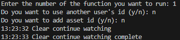

> 📘 Note
> 
> For more information about the API call used got to [Clear Continue Watching](doc:clear-continue-watching)

## Clear Watchlist

To clear watchlist data, enter 2 when prompted. Then enter the id of the user the watchlist data belongs to (defaults to current user's id).

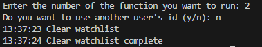

> 📘 Note
> 
> For more information about the API call used got to [Clear Watchlist](doc:clear-watchlist)

## Create Form

Before you make a form, you need to create the content definition where you want to post records too first. Follow the instructions [here](doc:content-definitions) on how to create a content definition and find its ID. To make a form enter 3 when prompted. Then enter the id of the content definition you want to use, the first and last name, whether you want it to be active or not, the start date, and the description.

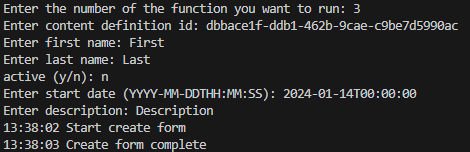

> 📘 Note
> 
> For more information about the API call used got to [Forms](doc:forms)

## Get Content Cookies.

To get content cookies, enter 4. Then enter the id of the content the cookies are located in.

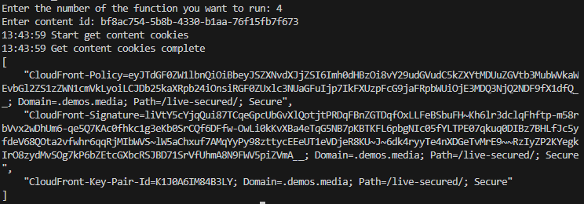

> 📘 Note
> 
> For more information about the API call used got to [Get Content Cookies](doc:get-content-cookies)

## Get Default Site Config

To get the default site config, enter 5 when prompted.

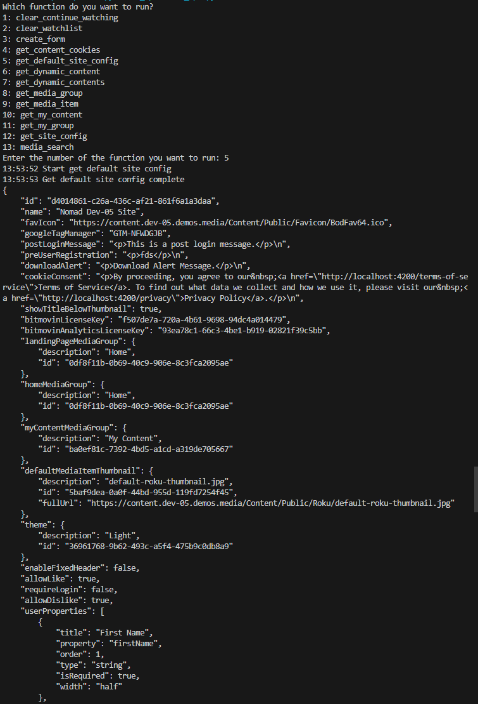

> 📘 Note
> 
> For more information about the API call used got to [Get Default Site Config](doc:get-default-site-config)

## Get Dynamic Content

To get a dynamic content, enter 6 when prompted. Then enter the id of the dynamic content you want to get.

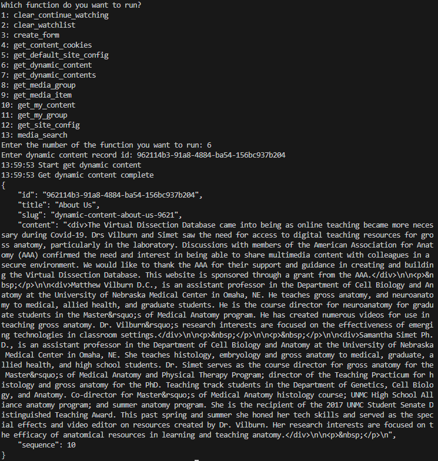

> 📘 Note
> 
> For more information about the API call used got to [Get Dynamic Content](doc:get-dynamic-content)

## Get Dynamic Contents

To get all dynamic contents, enter 7 when prompted.

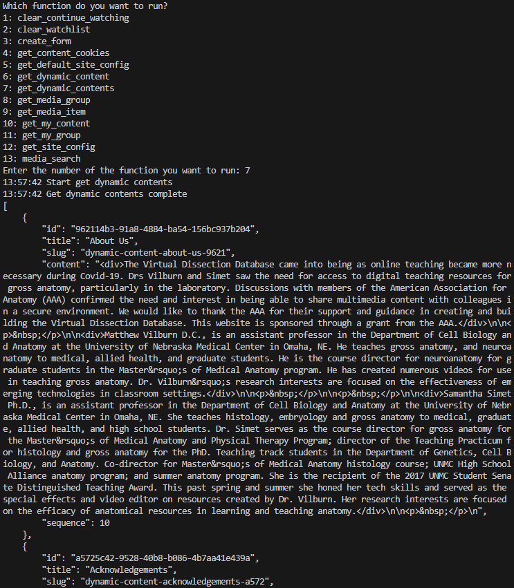

> 📘 Note
> 
> For more information about the API call used got to [Get Dynamic Contents](doc:get-dynamic-contents)

## Get Media Group

To get a media group, enter 8 when prompted. Then enter the id of the media group you want to get.

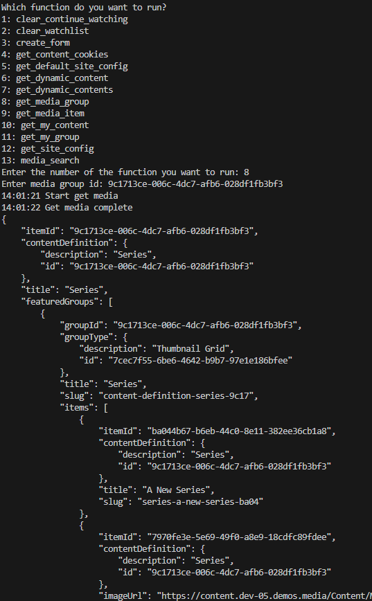

> 📘 Note
> 
> For more information about the API call used got to [Get Media Group](ref:get_media-group-id)

## Get Media Item

To get a media item, enter 9 when prompted. Then enter the id of the media item you want to get.

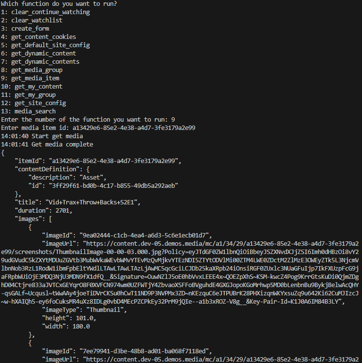

> 📘 Note
> 
> For more information about the API call used got to [Get Media Item](ref:get_media-item-id)

## Get My Content

To get your content, enter 10 when prompted.

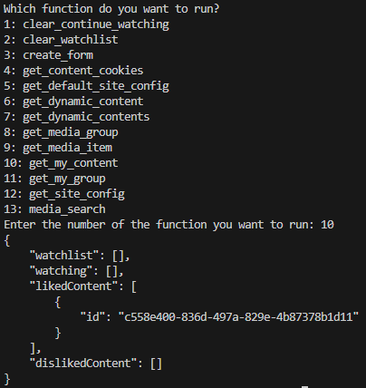

> 📘 Note
> 
> For more information about the API call used got to [Get My Content](ref:get_media-my-content)

## Get My Group

To get your group, enter 11 when prompted. Then enter the id of the group you want to get.

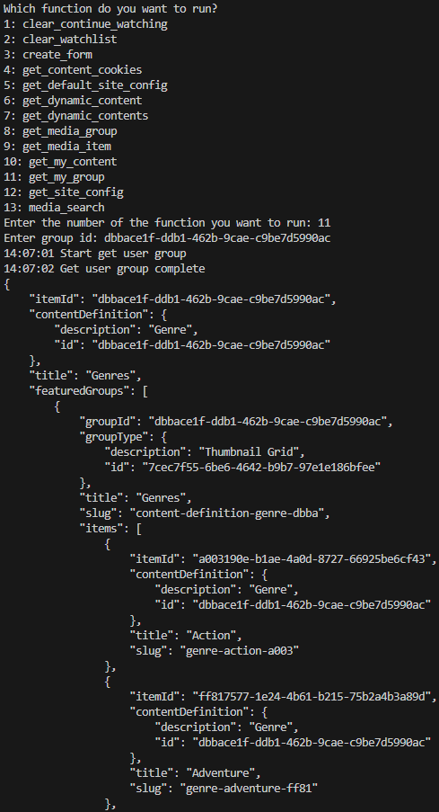

> 📘 Note
> 
> For more information about the API call used got to [Get My Group](doc:get-my-group)

## Get Site Config

To get a site config, enter 12 when prompted. Then enter the site config record id. 

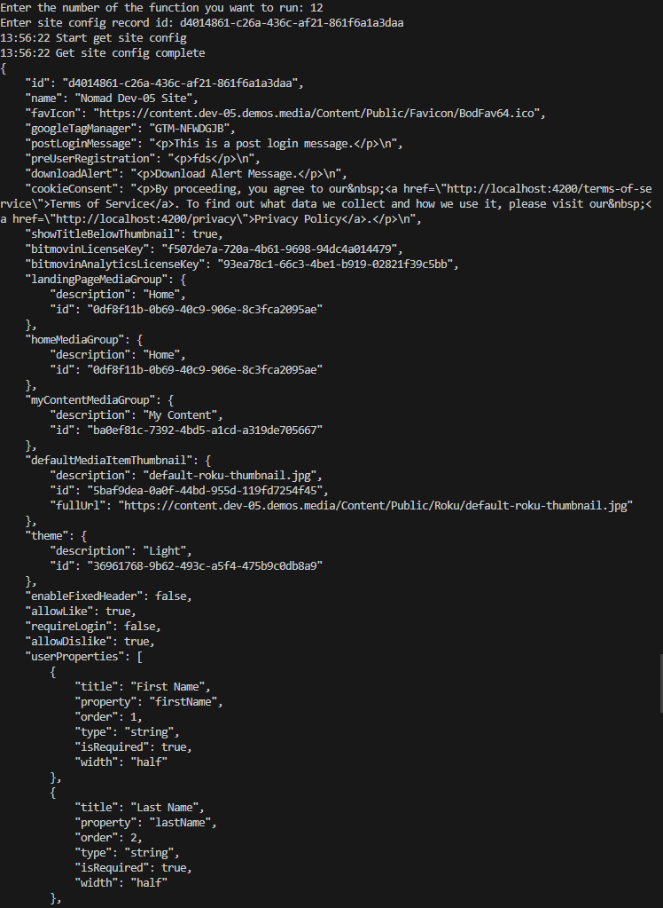

> 📘 Note
> 
> For more information about the API call used got to [Get Site Config](doc:get-site-config)

## Media Search

To perform a media search, enter 13 when prompted. Then enter the search query you want to use, the ids you want to search for, if you want to add a sort field the sort field name and order you want to sort by, and the offset and size of the result.

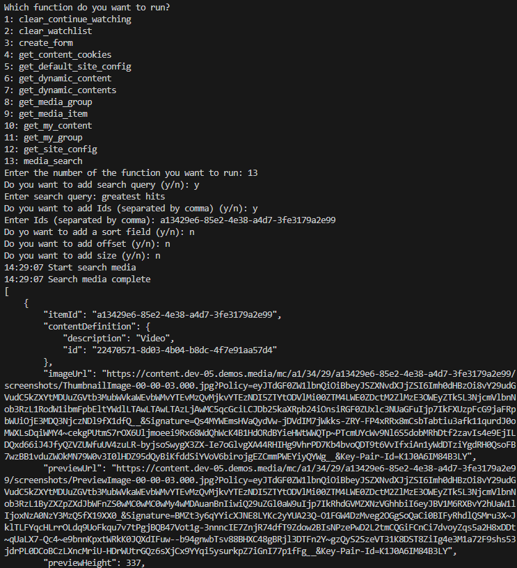

> 📘 Note
> 
> For more information about the API call used got to [Media Search](doc:search-1)