## Prerequisites

- Pip

> 📘 Note
> 
> You can download pip [here](https://pip.pypa.io/en/stable/installation/).

## Nomad SDK PIP

To learn how to download and setup the nomad sdk pip, go to [Nomad SDK PIP](https://github.com/Nomad-Media/nomad-sdk/tree/main/nomad-sdk-pip).

## Create Media Builder

To create a media builder, enter 1 when propmted. Then enter the name you want to give to your media builder. Optionally, you can also enter the id of the destination folder where you want the media builder to be created and the collections, related contents, and properties you want to add to the media builder.

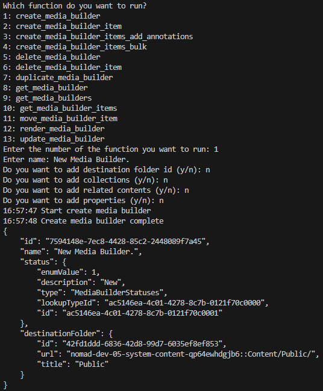

> 📘 Note
>
> For more information on the API used, go to [Create Media Builder](https://developer.nomad-cms.com/reference/post_mediabuilder).

## Create Media Builder Item

To create a media builder item, enter 2 when propmted. Then enter the id media builder and source asset, and optionally the start or the start and end time code, or the id of the annotation you want to add to the media builder item. Optionally you can also add related contents.

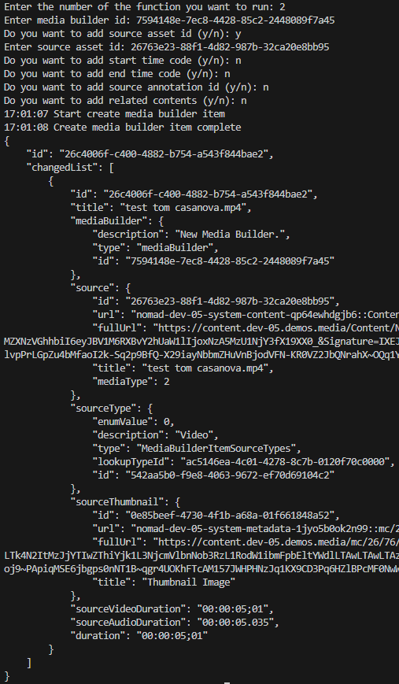

> 📘 Note
>
> For more information about the API call used, go to [Create Media Builder Item](https://developer.nomad-cms.com/reference/post_mediabuilder-mediabuilderid-items).

## Create Media Builder Items Add Annotations

To create media builder items from an asset using its annotations, enter 3 when propmted. Then enter the id of the media builder and source asset.

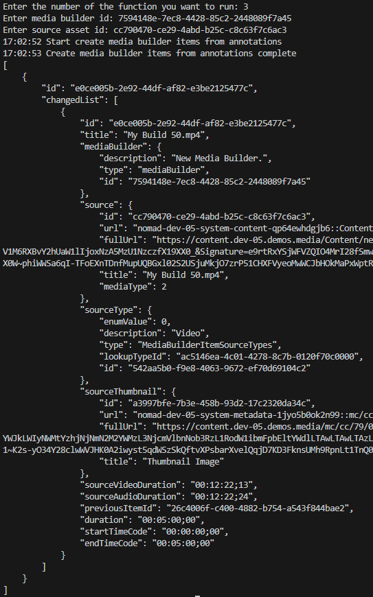

> 📘 Note
>
> For more information on the API call used, go to [Create Media Builder Item Add Annotations](https://developer.nomad-cms.com/reference/post_mediabuilder-mediabuilderid-items-sourceassetid-add-annotations).

## Create Media Builder Items Bulk

To create media builder items in bulk, enter 4 when propmted. Then enter the id of the media builder. Then add the source asset id, start time code, and optionally the end time code of the first media builder item you want to create. Then, if you want to add more media builder items, enter y when prompted and add the information for the next media builder item until you are done, then enter n when promted if you want to add another media builder.

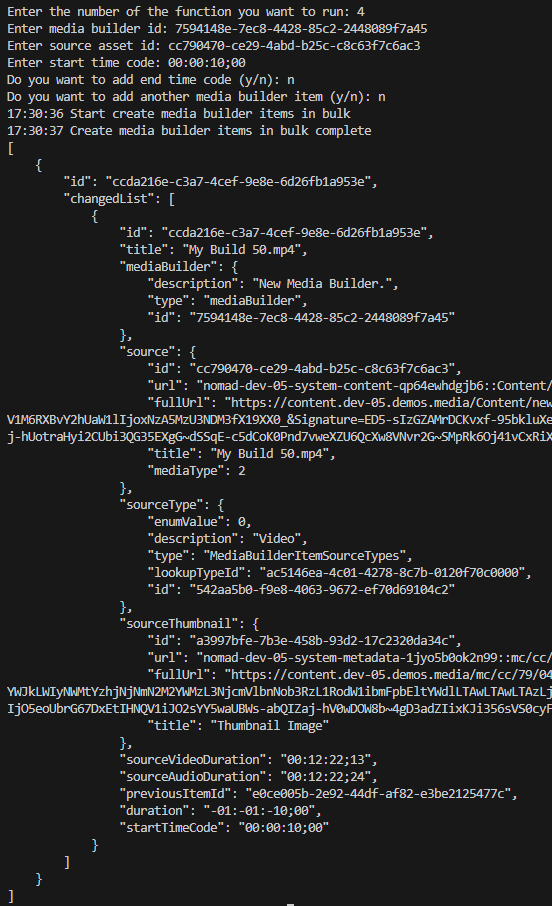

> 📘 Note
>
> For more information on the API call used, go to [Create Media Builder Items Bulk](https://developer.nomad-cms.com/reference/post_mediabuilder-mediabuilderid-items-bulk).

## Delete Media Builder

To delete a media builder, enter 5 when propmted. Then enter the id of the media builder you want to delete.

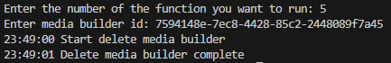

> 📘 Note
>
> For more information on the API call used, go to [Delete Media Builder](https://developer.nomad-cms.com/reference/delete_mediabuilder-mediabuilderid).

## Delete Media Builder Item

To delete a media builder item, enter 6 when propmted. Then enter the id of the media builder and the id of the media builder item you want to delete.

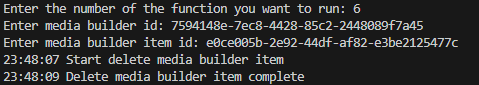

> 📘 Note
>
> For more information on the API call used, go to [Delete Media Builder Item](https://developer.nomad-cms.com/reference/delete_mediabuilder-mediabuilderid-items-itemid).

## Duplicate Media Builder

To duplicate a media builder, enter 7 when propmted. Then enter the id of the media builder you want to duplicate and the name you want to give to the duplicated media builder. Optionally, you can also enter the id of the destination folder where you want the duplicated media builder to be created and the collections, related contents, and properties you want to add to the duplicated media builder.

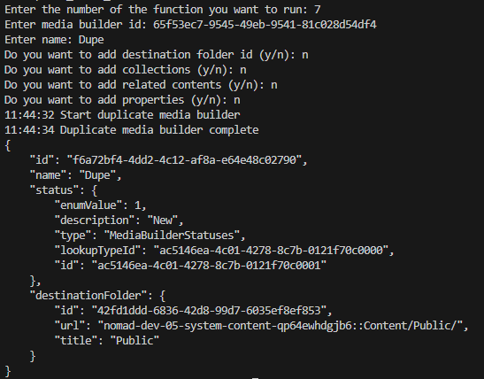

> 📘 Note
>
> For more information on the API call used, go to [Duplicate Media Builder](https://developer.nomad-cms.com/reference/post_mediabuilder-mediabuilderid-duplicate).

## Get Media Builder

To get a media builder, enter 8 when propmted. Then enter the id of the media builder you want to get.

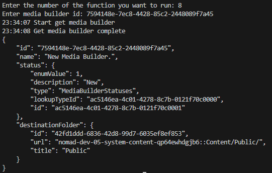

> 📘 Note
>
> For more information on the API call used, go to [Get Media Builder](https://developer.nomad-cms.com/reference/get_mediabuilder-mediabuilderid).

## Get Media Builders

To get all media builders, enter 9 when propmted.

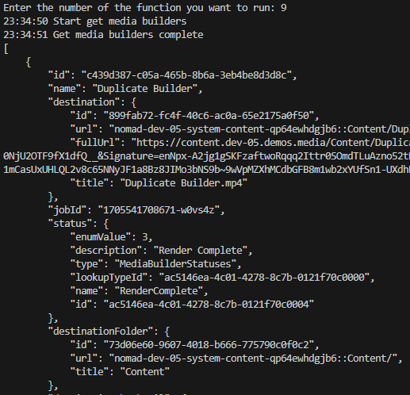

> 📘 Note
>
> For more information on the API call used, go to [Get Media Builders](https://developer.nomad-cms.com/reference/get_mediabuilder).

## Get Media Builder Ids from an Asset

To get the media builder ids from an asset, enter 14 when propmted. Then enter the id of the asset you want to get the media builder ids from.

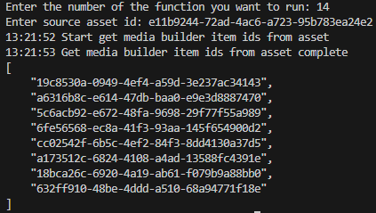

> 📘 Note
>
> For more information on the API call used, go to [Get Media Builder Ids from an asset](https://developer.nomad-cms.com/reference/get_mediabuilder-idsbysource-sourceassetid).

## Get Media Builder Items

To get all media builder items from a media builder, enter 10 when propmted. Then enter the id of the media builder you want to get the media builder items from.

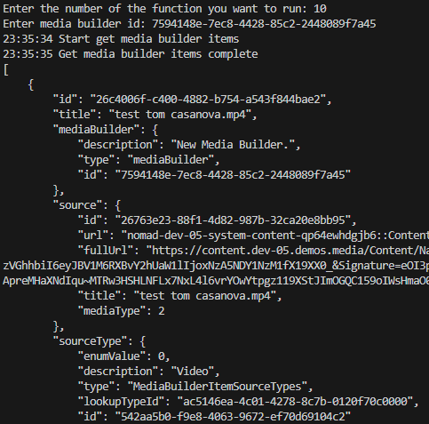

> 📘 Note
>
> For more information on the API call used, go to [Get Media Builder Items](https://developer.nomad-cms.com/reference/get_mediabuilder-mediabuilderid-items).

## Move Media Builder Items

To move media builder items from one media builder to another, enter 11 when propmted. Then enter the id of the media builder the media builder is in and the media builder is in. If you don't want to move the media builder to the top of the list, enter the id of the media builder item you want to move the media builder items after.

> 📘 Note
>
> For more information on the API call used, go to [Move Media Builder Items](https://developer.nomad-cms.com/reference/post_mediabuilder-mediabuilderid-items-itemid-move).

## Render Media Builder

To render a media builder, enter 12 when propmted. Then enter the id of the media builder you want to render.

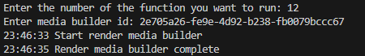

> 📘 Note
>
> For more information on the API call used, go to [Render Media Builder](https://developer.nomad-cms.com/reference/post_mediabuilder-mediabuilderid-render).

## Update Media Builder

To update a media builder, enter 13 when propmted. Then enter the id of the media builder you want to update. Optionally, you can also enter the name you want to give to the media builder, the id of the destination folder where you want the media builder to be created, and the collections, related contents, and properties you want to add to the media builder.

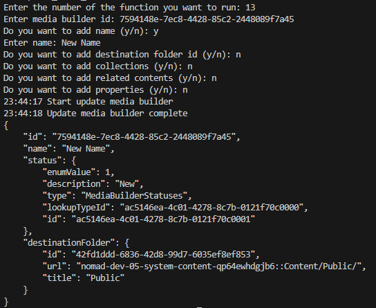

> 📘 Note
>
> For more information on the API call used, go to [Update Media Builder](https://developer.nomad-cms.com/reference/put_mediabuilder-mediabuilderid).