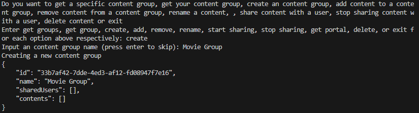
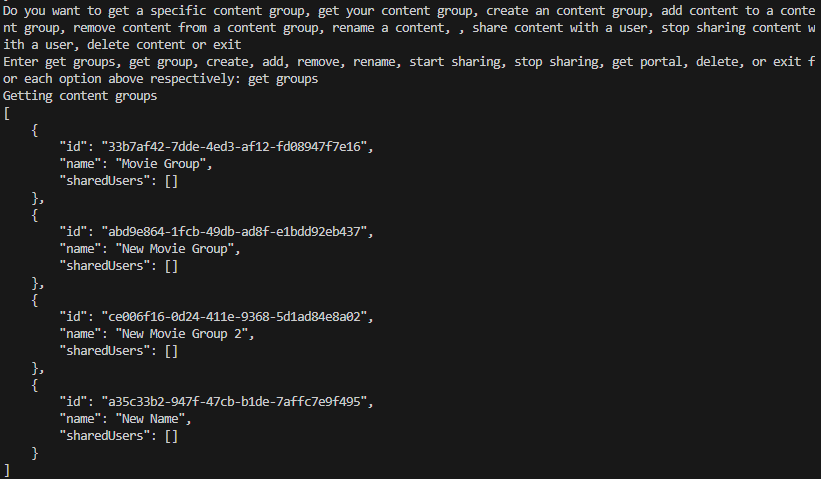
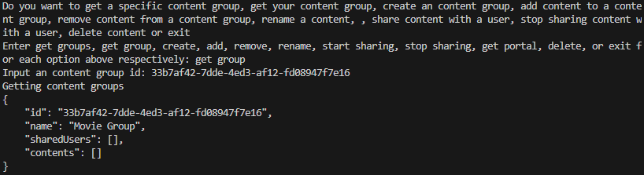
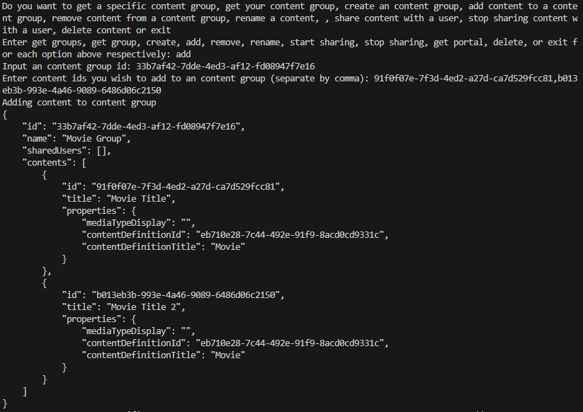
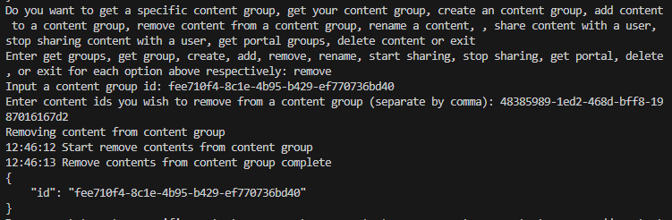
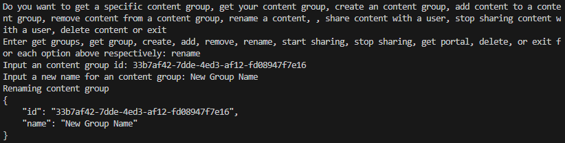
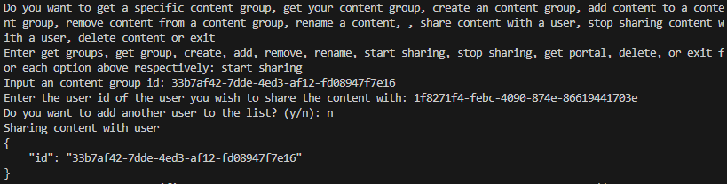
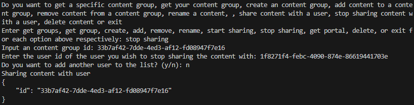
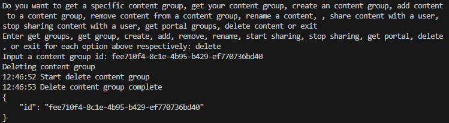

## Create Movie Group

To create a movie group, enter create when prompted. Then you need to enter the name you want to assign to the content group.

> 📘 Note
> 
> For more information about the API call used go to [Creates a content group.](ref:createcontentgroup)

## Get Movie Groups

To get all of the movie groups you created and were shared to your user, enter get groups when prompted.

> 📘 Note
> 
> For more information about the API call used go to [Gets a content group.](ref:getcontentgroup)

## Get Movie Group

To get a specific movie group by id, enter get group when prompted. Then enter the id of the movie you want to get.

> 📘 Note
> 
> For more information about the API call used go to [Gets content groups.](ref:getcontentgroups)

## Add Movie to Movie Group

To add movies to a movie group, enter add when prompted. Then enter the id of the movie group and the id(s), separated by comma.

> 📘 Note
> 
> For more information about the API call used go to [Adds content to a content group.](ref:addcontenttocontentgroup)

## Remove Movie from Movie Group

To remove a movie from a movie group, enter the id of the group you want to remove the movie from and the id(s) of the movie(s) you want to remove from that group.

> 📘 Note
> 
> For more information about the API call used go to [Removes contents from content group.](ref:removecontentsfromcontentgroups)

## Rename Movie Group

To rename a movie group, enter rename when prompted. Then enter the movie group id of the movie group you want to rename and the new name you want to rename the movie group to.

> 📘 Note
> 
> For more information about the API call used go to [Renames a content group.](ref:renamecontentgroup)

## Share Movie Group with User

To share a movie group with a user, enter start sharing when prompted. Then enter the id of the movie group you want to share to the user. Next, enter the id of a user you want to share the movie group with. It will prompt you to enter if you want to share the group with another user until you enter n.

> 📘 Note
> 
> For more information about the API call used go to [Shares a content group.](ref:sharecontentgroup)

## Stop Sharing Movie Group with User

To stop sharing a movie group with a user, enter stop sharing when prompted. Then enter the id of the movie group you want to stop sharing to the user. Next, enter the id of a user you want to share the movie group with. It will prompt you to enter if you want to share the group with another user until you enter n.

> 📘 Note
> 
> For more information about the API call used go to [Stops sharing a content group.](ref:stopsharingcontentgroup)

## Delete Movie Group

To delete a movie group, enter the id of the movie group you want to delete.

> 📘 Note
> 
> For more information about the API call used go to [Deletes a content group.](ref:deletecontentgroup)