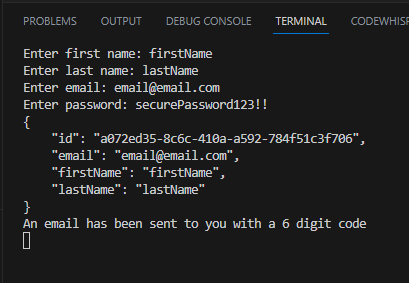
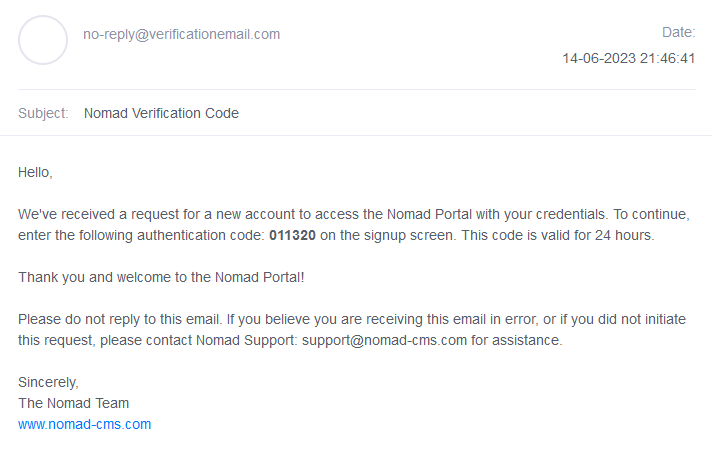
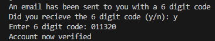
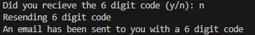
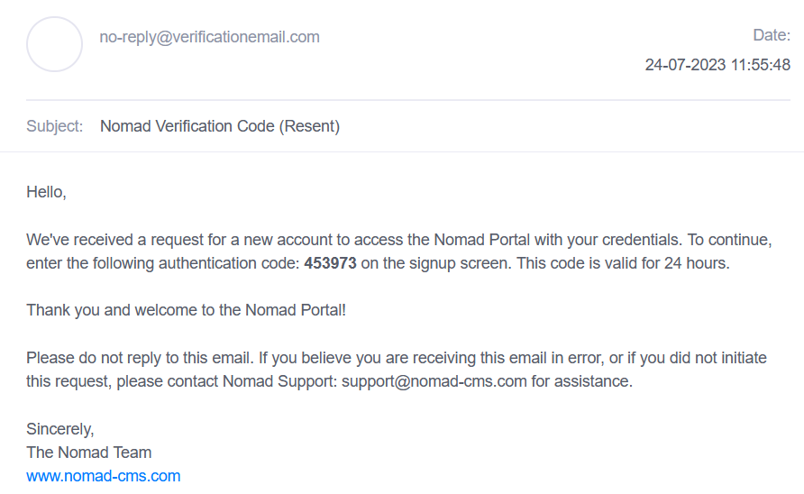

## Prerequisites

- Pip

> 📘 Note
> 
> You can download pip [here](https://pip.pypa.io/en/stable/installation/).

## Nomad SDK PIP

To learn how to download and setup the nomad sdk pip, go to [Nomad SDK PIP](doc:nomad-sdk-pip).

## Register

Go to account_registration.py and run the code. It should ask you for your first and last name, email, and password.

You should now get an email from Nomad with a 6 digit code

Respond with "y" to the prompt "Did you receive a 6 digit code" if you got the email. Enter the code into the terminal and you will get a message verifying that you are now verified.

> 📘 Note
> 
> For more information about the API calls used go to [Registers a user.](ref:register-1) [Verifies a user.](ref:verify-1)

## Resend Code

If an email didn't get sent to you respond with"n" to the prompt "Did you receive a 6 digit code". You will be sent a new email with a 6 digit code.

> 📘 Note
> 
> For more information about the API call used go to [Resends a code.](ref:resendcode)