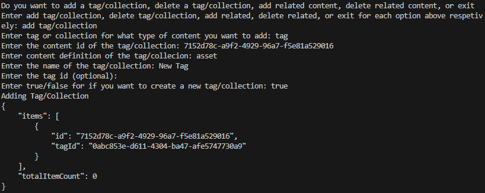
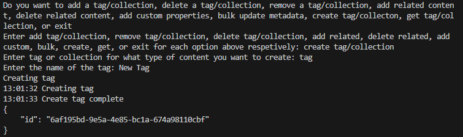
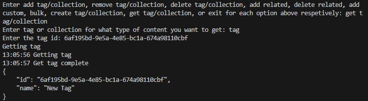
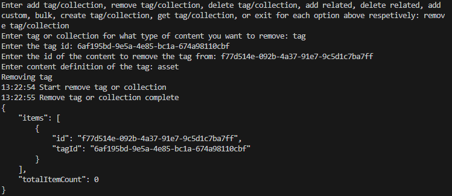
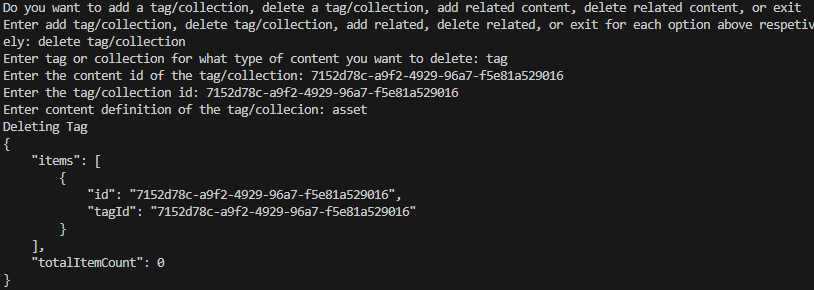
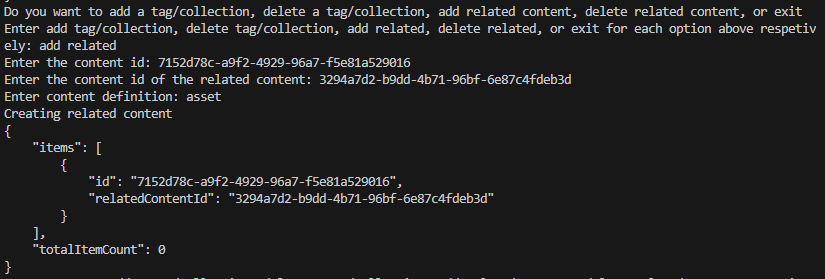
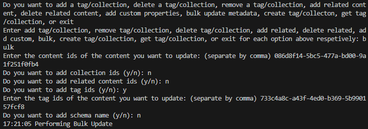

## Prerequisites

- Pip

> 📘 Note
> 
> You can download pip [here](https://pip.pypa.io/en/stable/installation/).

## Nomad SDK PIP

To learn how to download and setup the nomad sdk pip, go to [Nomad SDK PIP](doc:nomad-sdk-pip).

## Content ID

To get the content id of the video or image of the movie you want to add the metadata to, use the movie search function here [Movies](doc:upload-movies).

## Add Tag or Collection

To add a tag or collection to a content enter add tag/collection when prompted. Then, enter whether you want to create a tag or collection by inputting tag or collection. Next, enter the content id of the asset you add, the content definition, and the name of the tag/collection. Finally enter the tag id and false for creating a new tag/collection if you want to add an existing tag or collection or leave the tag id blank and true for creating a new tag/collection.

> 📘 Note
> 
> For more information about the API call used go to [Adds a tag or collection to a content.](ref:addtagorcollection)

## Create Tag or Collection

To create a tag or collection, enter create tag/collection when prompted. Then enter whether you want to create a tag or collection and the name of the tag/collection.

> 📘 Note
> 
> For more information about the API call used go to [Creates a tag or collection.](ref:createtagorcollection)

## Get Tag or Collection

To get a tag or collection, enter whether you want to get a tag or collection, and the id of the tag/collection.

> 📘 Note
> 
> For more information about the API call used go to [Gets a tag or collection.](ref:gettagorcollection)

## Remove Tag or Collection

To remove a tag or collection from a content, enter remove tag/collection. Then enter if you want to remove a tag or collection, the id of the tag/collection, the id of the content you want to remove the tag/collection from, and the content definition of the content.

> 📘 Note
> 
> For more information about the API call used go to [Removes a tag or collection from a content.](ref:removetagorcollection)

## Delete Tag or Collection

To delete a tag or collection enter delete tag/collection when prompted. Then, enter whether you want to create a tag or collection by inputting tag or collection. Next, enter the content id of the asset you add, the tag/collection id of the tag/collection you want to delete, and  the content definition.

> 📘 Note
> 
> For more information about the API call used go to [Deletes a tag or collection from a content.](ref:deletetagorcollection)

## Add Related Content

For this example we are going to add the image in our movie as the related content for the video in our movie. First enter add related when prompted. Then enter the content id of the video of your movie when prompted for content id and the content id of the image of your movie when prompted for related id. Then enter asset for the content definition.

> 📘 Note
> 
> For more information about the API call used go to [Adds related content to a content.](ref:addrelatedcontent)

## Delete Related Content

To delete the related content made in the example above, enter the content id of the movie when prompted for the content Id, the video id when prompted for the related Content Id, and asset for content definition.

> 📘 Note
> 
> For more information about the API call used go to [Deletes related content from a content.](ref:deleterelatedcontent)

## Bulk Update

To update metadata in bulk enter bulk. Then enter the id(s) of the content(s) you want to update. Then add the collection id(s), the related content id(s), and/or the tag id(s) you want to update.

> 📘 Note
> 
> For more information about the API call used go to [Bulk updates the metadata of a content.](ref:bulkupdatemetadata)