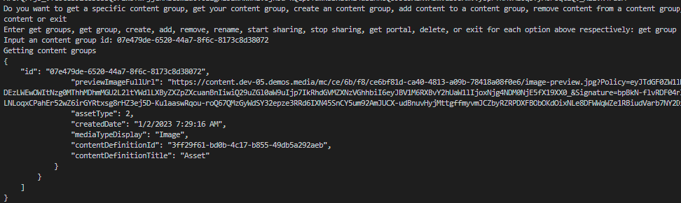
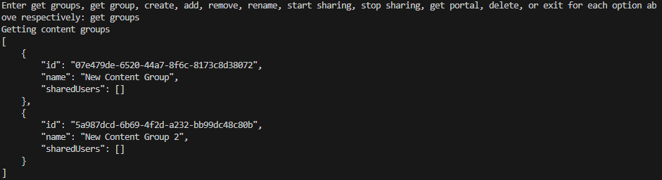
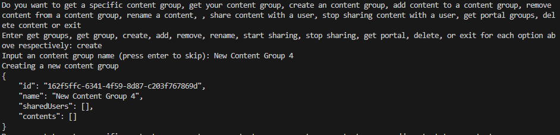
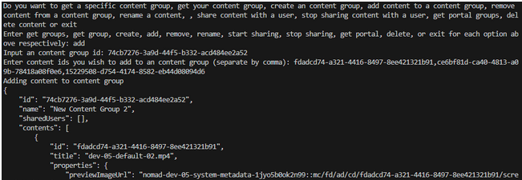
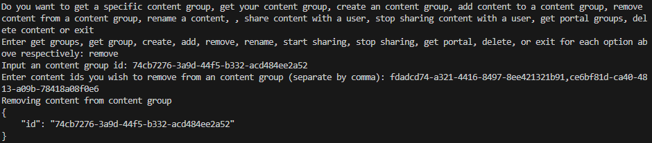
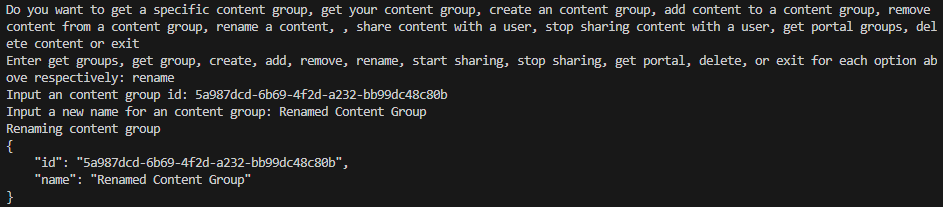
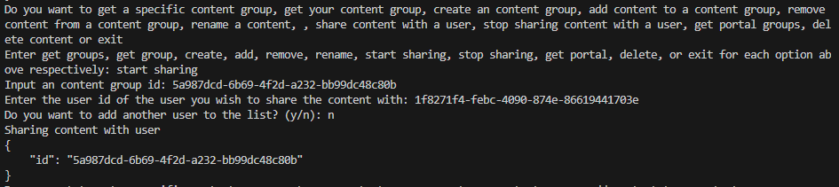
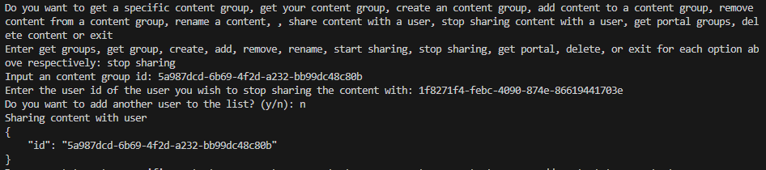
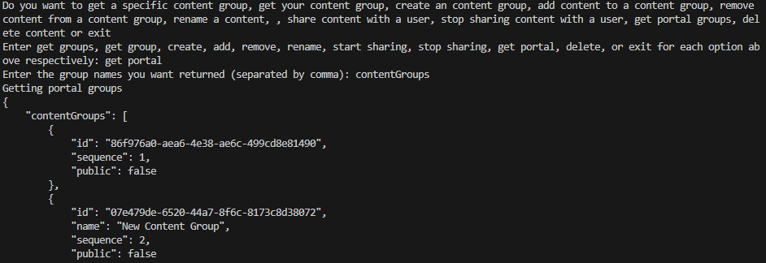
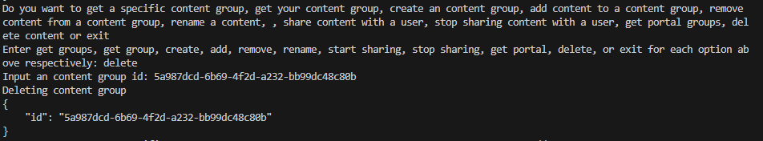

## Prerequisites

- Pip

> 📘 Note
> 
> You can download pip [here](https://pip.pypa.io/en/stable/installation/).

## Nomad SDK PIP

To learn how to download and setup the nomad sdk pip, go to [Nomad SDK PIP](doc:nomad-sdk-pip).

## Get Content Group

To get a specific content group, enter get group into the terminal. It will then prompt you for the content group id of the content group you want to get. You can only see a content group if you are the owner, or have been shared the content group.

> 📘 Note
> 
> For more information about the API calls used go to [Gets a content group.](ref:getcontentgroup)

## Get Content Groups

To get your content groups and the content groups shared with you, enter get groups into the terminal. You can only see a content group if you are the owner, or have been shared the content group.

> 📘 Note
> 
> For more information about the API calls used go to [Gets content groups.](ref:getcontentgroups)

## Create Content Group

To create a content group, enter create into the terminal. Then you will be prompt to input a content group name.

> 📘 Note
> 
> For more information about the API calls used go to [Creates a content group.](ref:createcontentgroup)

## Add Content to Content Group

To add content to a content group, enter add into the terminal. Then you will be prompted for a content group id and content ids.

> 📘 Note
> 
> For more information about the API calls used go to [Adds content to a content group.](ref:addcontenttocontentgroup)

## Remove Content from Content Group

To remove content from a content group, enter remove into the terminal. Then you will be prompted for an content group id and content ids.

> 📘 Note
> 
> For more information about the API calls used go to [Removes contents from content group.](ref:removecontentsfromcontentgroups)

## Rename Content Group

To rename  group, enter rename into the terminal. Then you will be prompted for an content group id and a new name for the content group.

> 📘 Note
> 
> For more information about the API calls used go to [Renames a content group.](ref:renamecontentgroup)

## Share Content Group

To start sharing a content group with another user, enter start sharing into the terminal. Then enter the content group id for the content. You will then be asked for the user id of the user you want to share the content with. When you enter the user id, you will be prompted if you want to enter another user id. Enter y to keep on entering user ids and n to continue. Only the owner of the content group can share the content group with other users.

> 📘 Note
> 
> For more information about the API calls used go to [Shares a content group.](ref:sharecontentgroup)

## Stop Sharing Content Group

To stop sharing a content group with another user, enter stop sharing into the terminal. Then enter the content group id for the content. You will then be asked for the user id of the user you want to stop sharing the content with. When you enter the user id, you will be prompted if you want to enter another user id. Enter y to keep on entering user ids and n to continue. Only the owner of the content group can stop sharing the content group with other users.

> 📘 Note
> 
> For more information about the API calls used go to [Stops sharing a content group.](ref:stopsharingcontentgroup)

## Get Portal Groups

To get the portal groups, enter get portal into the terminal. Then enter the name(s) of the portal groups you want to get. The portal groups are SavedSearches, ContentGroups and SharedContentGroups. You can only see portal groups that you own or that have been shared with you.

> 📘 Note
> 
> For more information about the API calls used go to [Gets portal groups.](ref:getportalgroups)

## Delete Content Group

To delete an content group, enter delete into the terminal. Then you will be prompted for the content group id for the content group you want to delete.

> 📘 Note
> 
> For more information about the API calls used go to [Deletes a content group.](ref:deletecontentgroup)