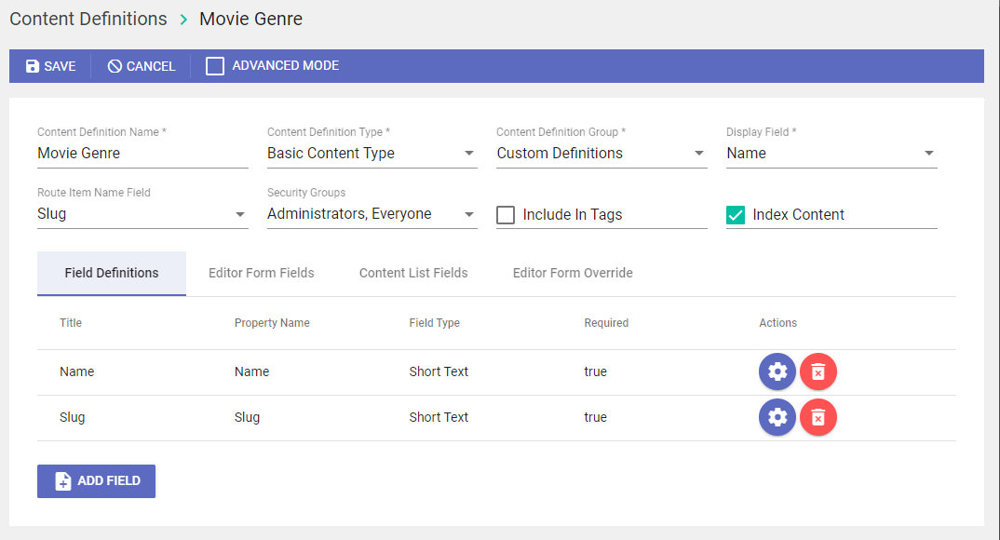

## Prerequisites

- Pip

> 📘 Note
> 
> You can download pip [here](https://pip.pypa.io/en/stable/installation/).

## Nomad SDK PIP

To learn how to download and setup the nomad sdk pip, go to [Nomad SDK PIP](doc:nomad-sdk-pip).

## Content Definition Setup

## Introduction

For this walkthrough we are assuming you read and understand the concepts and terminology explained in [Content Definitions](doc:content-definitions).

## Creating the Movie content definition

Let's create a new content definition called Movie with the following fields and settings:

| Title | Type | Required | Is Index Identifier | Editor Form Fields Tab | Content List Fields Tab |
|-------|------|----------|---------------------|------------------------|------------------------|
| Title | Short Text | Yes | Yes | Yes | Yes |
| Slug | Short Text Slugify | Yes | Yes | Yes | No |
| Plot | Long Text | No | Yes | Yes | Yes |
| Genres | Lookup Multi-Select | No | Yes | Yes | Yes |
| Tags | Lookup Multi-Select | No | Yes | Yes | Yes |
| Performers | Lookup Multi-Select | No | Yes | Yes | Yes |
| Ratings | Related Content Definition | No | Yesq | Yes | Yes |
| Release Date | Date | No | Yes | Yes | Yes |
| Image | Image Selector | No | Yes | Yes | Yes |
| Video | Asset Selector | No | Yes | Yes | Yes |

The completed Movie content definition will look like this:

## Creating the Movie Genre content definition

Let's create another content definition to add more metadata to the asset for use in queries. This one will be a Movie Genre content definition.

| Title | Type | Required | Is Index Identifier | Editor Form Fields Tab | Content List Fields Tab |
|-------|------|----------|---------------------|------------------------|------------------------|
| Name | Short Text | Yes | Yes | Yes | Yes |
| Slug | Short Text Slugify | Yes | Yes | Yes | No |

The completed Movie Genre content definition will look like this:

## Other Content Definitions

Here are the tables for the other Content Definitions:

Tags:

| Title | Type       | Required | Is Index Identifier | Editor Form Fields Tab | Content List Fields Tab |
| :---- | :--------- | :------- | :------------------ | :--------------------- | :---------------------- |
| Name  | Short Text | Yes      | Yes                 | Yes                    | Yes                     |

Performers:

| Title | Type | Required | Is Index Identifier | Editor Form Fields Tab | Content List Fields Tab |
|-------|------|----------|---------------------|------------------------|------------------------|
| Name | Short Text | Yes | Yes | Yes | Yes |
| Slug | Short Text Slugify | Yes | Yes | Yes | No |

Ratings:
| Title | Type | Required | Is Index Identifier | Editor Form Fields Tab | Content List Fields Tab |
|-------|------|----------|---------------------|------------------------|------------------------|
| Name | Short Text | Yes | Yes | Yes | Yes |
| Slug | Short Text Slugify | Yes | Yes | Yes | No |