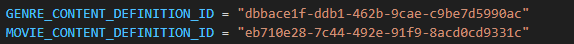
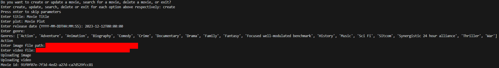
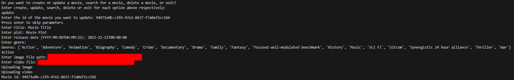
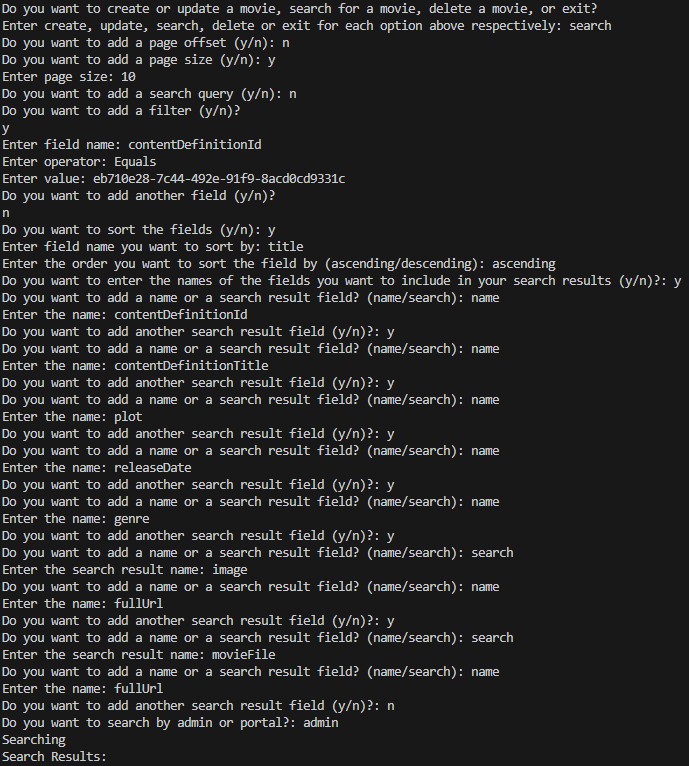
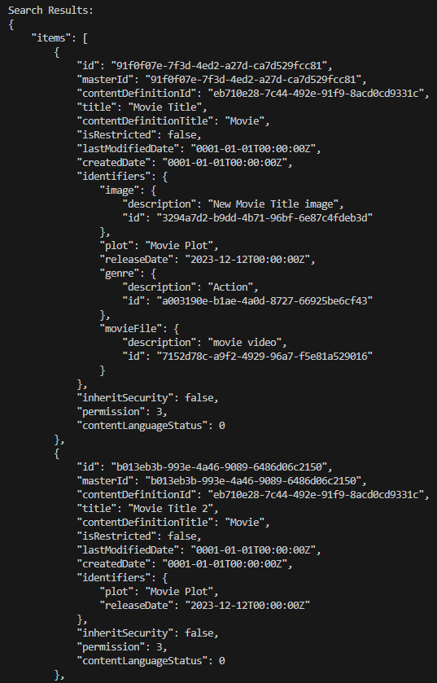
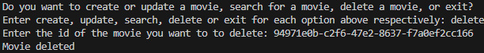

## Content Definitions

For this sample, change the content definition ids in the file to reflect your environment.

## Create Movie

To create a movie enter create when prompted. Then enter the title, plot, release date, genre, image file and video file when prompted. If you want to leave an entry blank, press enter for the field you want to leave blank. If you want to use a genre that is not on the list, enter the genre you want to add under Enter Genre and a new genre will be created and added to the list. When the movie is done being created, it will print the id of the movie that you created.

> 📘 Note
> 
> For more information about the API calls used go to [Creates a content.](ref:createcontent)

## Update Movie

To update the movie, enter update when prompted. Then it is the same process as creating a movie with the addition of adding the id of the movie you want to update.

> 📘 Note
> 
> For more information about the API calls used go to [Updates a content.](ref:updatecontent)

## Search Movie

To search for a movie, enter search when prompted. Then you will be asked if you want to add a filter. If you enter y, you will be asked for a field name, operator, and value. To know what to put for these values, go [here](doc:search-query-syntax) to read the documentation for content searching. Then enter the field names you want to print out in Enter field names. Finally enter the title you want to sort by and the sort order.

> 📘 Note
> 
> For more information about the API calls used go to [Search.](ref:search-3)

## Delete Movie

To delete a movie, enter delete when prompted. Then you will be asked the id of the movie you want to delete.

> 📘 Note
> 
> For more information about the API call used go to [Deletes a content.](ref:deletecontent)