## Prerequisites

- Pip

> 📘 Note
> 
> You can download pip [here](https://pip.pypa.io/en/stable/installation/).

## Nomad SDK PIP

To learn how to download and setup the nomad sdk pip, go to [Nomad SDK PIP](doc:nomad-sdk-pip).

## Delete User

To delete a user enter 1 for the delete_user function. Then enter the id of the user you want to delete. If you leave the id blank, it will delete the current user.

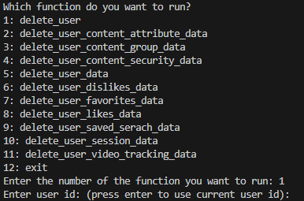

> 📘 Note
> 
> For more information about the API calls used go to [Deletes a user.](ref:deleteuser)

## Delete User Content Attribute Data

To delete a user's content attribute data, enter 2 for the delete_user_content_attribute_data function. Then enter the id of the user you want to delete the user's content attribute data of. If you leave the id blank, it will delete the current user's content attribute data.

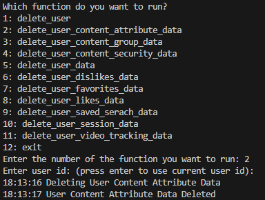

> 📘 Note
> 
> For more information about the API calls used go to [Deletes a user's content attribute data.](ref:deleteusercontentattributedata)

## Delete User Content Group Data

To delete a user's content group data, enter 3 for the delete_user_content_group_data function. Then enter the id of the user you want to delete the user's content group data of. If you leave the id blank, it will delete the current user's content group data.

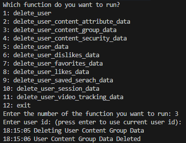

> 📘 Note
> 
> For more information about the API calls used go to  [Deletes a user's content group data.](ref:deleteusercontentgroupdata)

## Delete User Content Security Data.

To delete a user's content security data, enter 4 for the delete_user_content_security_data function. Then enter the id of the user you want to delete the user's content security data of. If you leave the id blank, it will delete the current user's content security data. Then enter the content id, content definition id, user id, email, id, key name, and/or expiration date of the content you want to delete the security data of.

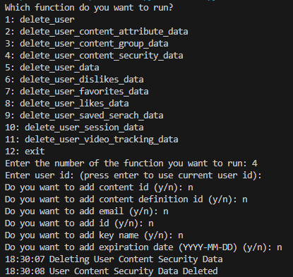

> 📘 Note
> 
> For more information about the API calls used go to [Deletes a user's content security data.](ref:deleteusercontentsecuritydata)

## Delete User Data

To delete a user's data, enter 5 for the delete_user_data function. Then enter the id of the user you want to delete the user's data of. If you leave the id blank, it will delete the current user's data.

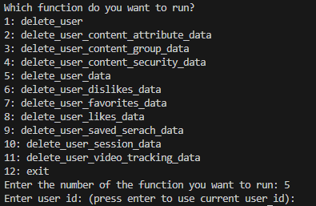

> 📘 Note
> 
> For more information about the API calls used go to [Deletes a user's data.](ref:deleteuserdata)

## Delete User Dislikes Data

To delete a user's dislike data, enter 6 for the delete_user_dislikes_data function. Then enter the id of the user you want to delete the user's dislike data of. If you leave the id blank, it will delete the current user's dislike data.

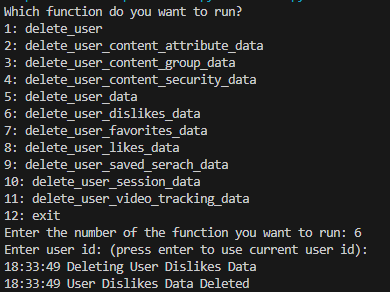

> 📘 Note
> 
> For more information about the API calls used go to [Deletes a user's data.](ref:deleteuserdata)

## Delete User Favorites Data

To delete a user's favorites data, enter 7 for the delete_user_favorites_data function. Then enter the id of the user you want to delete the user's favorites data of. If you leave the id blank, it will delete the current user's favorites data.

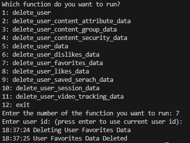

> 📘 Note
> 
> For more information about the API calls used go to [Deletes a user's favorites data](ref:delete_admin-user-favorite-userid)

## Delete User Likes Data

To delete a user's likes data, enter 8 for the delete_user_likes_data function. Then enter the id of the user you want to delete the user's likes data of. If you leave the id blank, it will delete the current user's likes data.

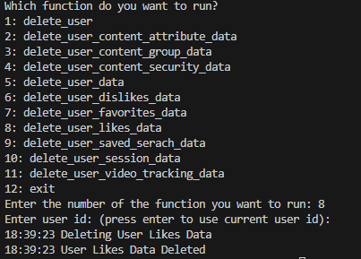

> 📘 Note
> 
> For more information about the API calls used go to [Deletes a user's likes data](ref:delete_admin-user-like-userid)

## Delete User Saved Search Data

To delete a user's saved search data, enter 9 for the delete_user_saved_search_data function. Then enter the id of the user you want to delete the user's saved search data of. If you leave the id blank, it will delete the current user's saved search data.

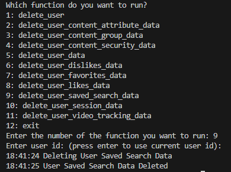

> 📘 Note
> 
> For more information about the API calls used go to [Deletes a user's saved search data.](ref:deleteusersavedsearchdata)

## Delete User Session Data

To delete a user's session data, enter 10 for the delete_user_session_data function. Then enter the id of the user you want to delete the user's session data of. If you leave the id blank, it will delete the current user's session data.

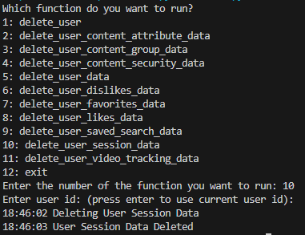

> 📘 Note
> 
> For more information about the API calls used go to [Deletes a user's session data.](ref:deleteusersessiondata)

## Delete User Video Tracking Data

To delete a user's video tracking data, enter 11 for the delete_user_video_tracking_data function. Then enter the id of the user you want to delete the user's video tracking data of. If you leave the id blank, it will delete the current user's video tracking data. Then enter the asset id, content id, video tracking attribute id, id, is first quartile, is midpoint, is third quartile, is complete, is hidden, is live stream, max second, last second, total second, last beacon date and/or key name of the video tracking data you want to delete.

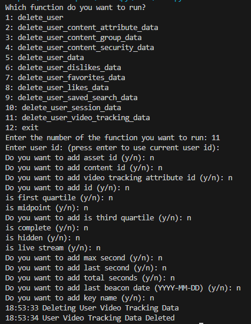

> 📘 Note
> 
> For more information about the API calls used go to [Deletes a user's video tracking data.](ref:deleteuservideotrackingdata)