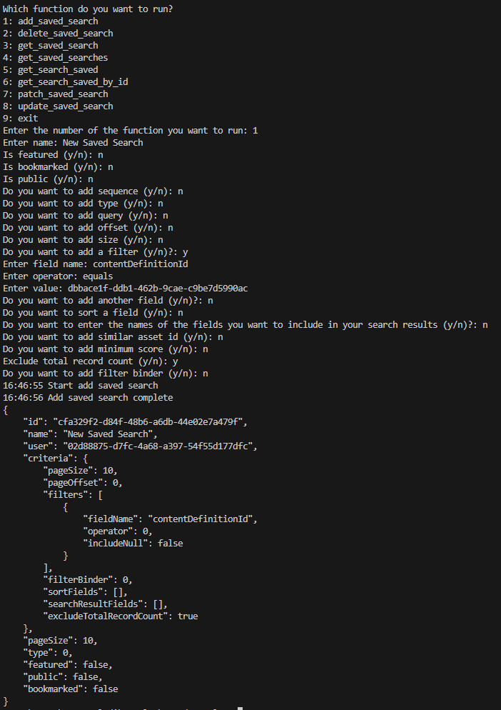
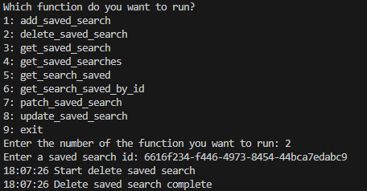
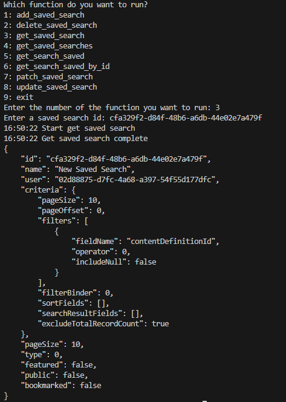
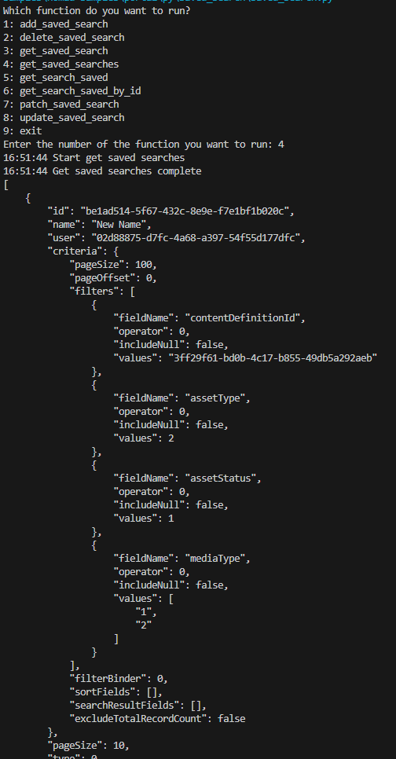
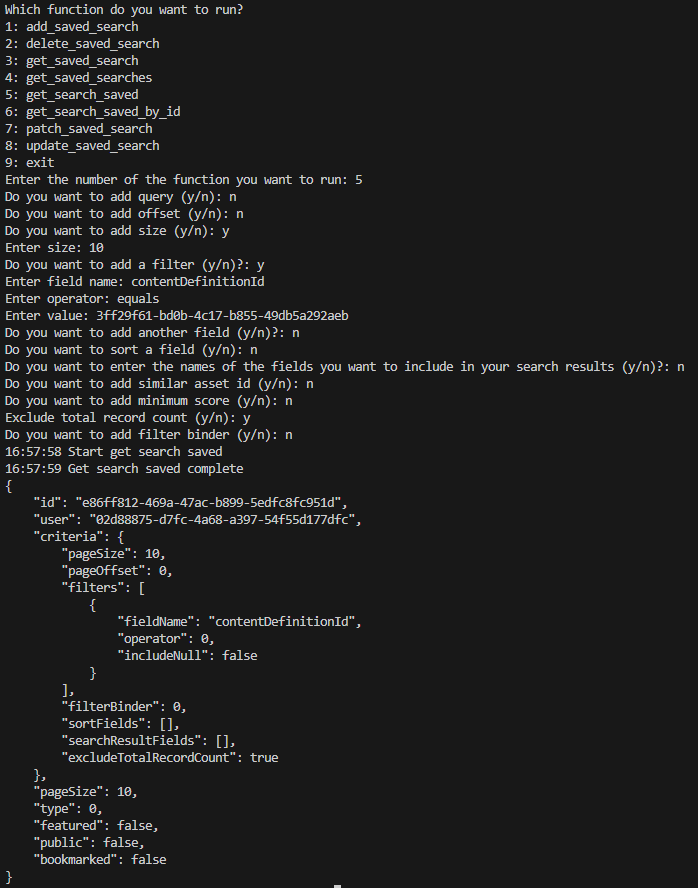
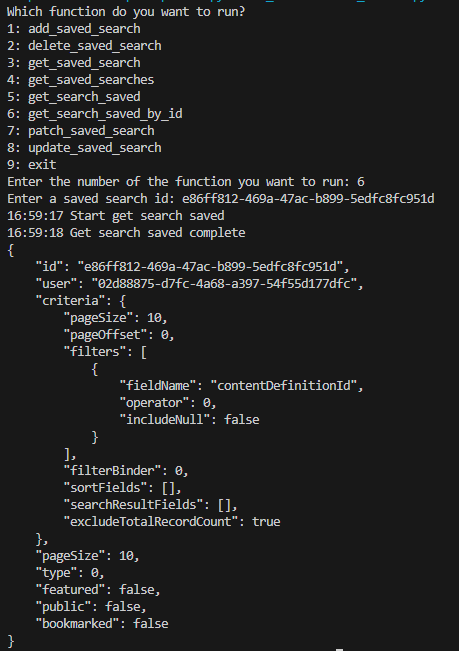
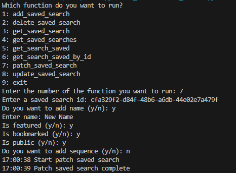
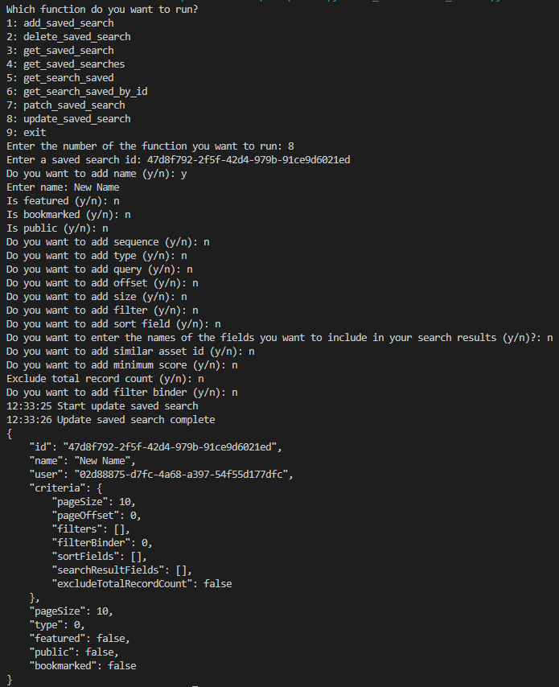

## Prerequisites

- Pip

> 📘 Note
> 
> You can download pip [here](https://pip.pypa.io/en/stable/installation/).

## Nomad SDK PIP

To learn how to download and setup the nomad sdk pip, go to [Nomad SDK PIP](doc:nomad-sdk-pip).

## Add Saved Search

To add a saved search enter 1 when prompted. Then enter the information you want to add to your saved searches.

> 📘 Note
> 
> For more information about the API call used go to [Adds a saved search.](ref:addsavedsearch)

## Delete Saved Search

To delete a saved search, enter 2 when prompted. Then enter the id of the saved search you want to delete.

> 📘 Note
> 
> For more information about the API call used go to [Deletes a saved search.](ref:deletesavedsearch)

## Get Saved Search

To get a saved search, enter 3 when prompted. Then enter the id of the saved search you want to get.

> 📘 Note
> 
> For more information about the API call used go to [Gets a saved search.](ref:getsavedsearch)

## Get Saved Searches

To get all saved searches, enter 4 when prompted.

> 📘 Note
> 
> For more information about the API call used go to [Gets saved searches.](ref:getsavedsearches)

## Get Search Saved

To get the search saved, enter 5 when prompted. Then enter the parameters of the search you are looking for.

> 📘 Note
> 
> For more information about the API call used go to [Gets search saved.](ref:getsearchsaved)

## Get Search Saved By Id

To get a search saved by id, enter 6 when prompted. Then enter the id of the search saved you want to get.

> 📘 Note
> 
> For more information about the API call used go to [Get Search Saved By Id](doc:get-search-saved-by-id)

## Patch Saved Search

To patch a saved search, enter 7 when prompted. Then enter the id of the saved search you want to patch and any data you want to patch.

> 📘 Note
> 
> For more information about the API call used go to [Patches a saved search.](ref:patchsavedsearch)

## Update Saved Search

To update a saved search, enter 8 when prompted. Then enter the id of the saved search you want to update and any data you want to update.

> 📘 Note
> 
> For more information about the API call used go to [Updates a saved search.](ref:updatesavedsearch)