## Prerequisites

- Pip

> 📘 Note
> 
> You can download pip [here](https://pip.pypa.io/en/stable/installation/).

## Nomad SDK PIP

To learn how to download and setup the nomad sdk pip, go to [Nomad SDK PIP](https://github.com/Nomad-Media/nomad-sdk/tree/main/nomad-sdk-pip).

## Create Intelligent Playlist

To create an intelligent playlist, enter 1 when prompted. Then enter the information you want to add to the intelligent playlist.

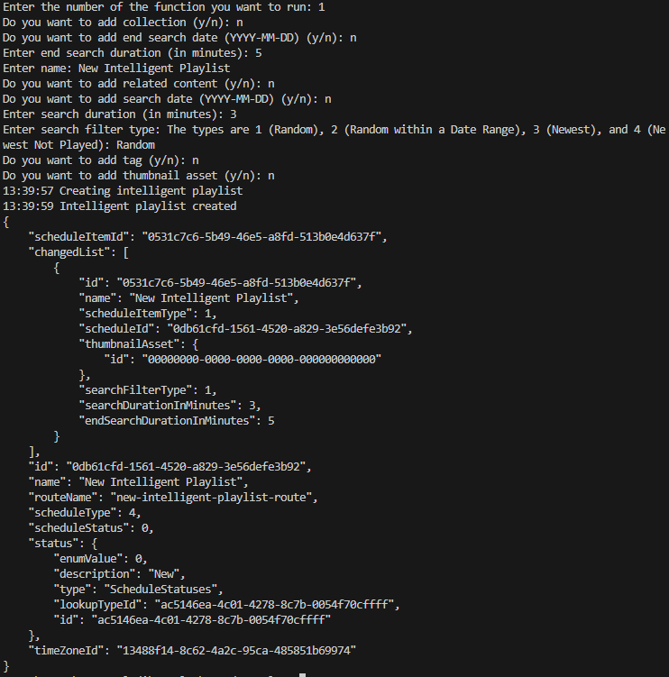

> 📘 Note
> 
> For more information about the API call used got to [Create Intelligent Playlist](https://developer.nomad-cms.com/docs/create-intelligent-playlist)

## Create Intelligent Schedule

To create an intelligent schedule, enter 2 when prompted. Then enter the default video asset id and name, the name, the thumbnail asset id and name if you want to add a thumbnail asset, and the id of the timezone for the schedule.

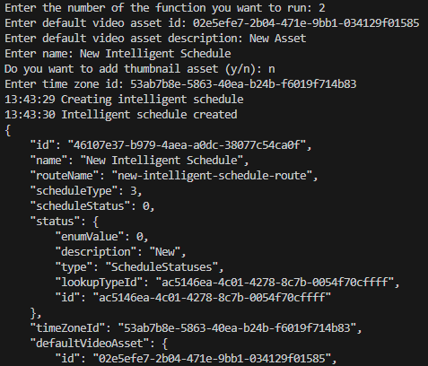

> 📘 Note
> 
> For more information about the API call used got to [Create Intelligent Schedule](https://developer.nomad-cms.com/docs/create-intelligent-schedule)

## Create Playlist

To create a playlist, enter 3 when prompted. Then enter the name of the playlist, the id of the thumbnail asset if you want to add it, whether or not to loop the playlist, and the id of the default video asset.

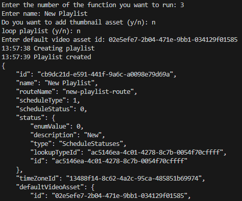

> 📘 Note
> 
> For more information about the API call used got to [Create Playlist](https://developer.nomad-cms.com/docs/create-playlist)

## Create Playlist Video

To create a playlist video, enter 4 when prompted. Then enter the id of the playlist you want to add the video to and the id of the video asset. Optionally enter the id of the video in the playlist you want to place the video after.

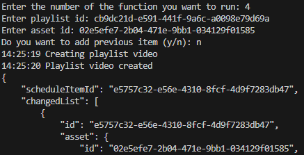

> 📘 Note
> 
> For more information about the API call used got to [Create Playlist Video](https://developer.nomad-cms.com/docs/create-playlist-video)

## Create Schedule Item Asset

To create a schedule item asset, enter 5 when prompted. Then enter the id of the schedule you want to add the assetl to, the name(s) of the day(s) you want the item to span, the duration time code, which is the difference between the end time code and the time code, the end time code, optionally the previous item id, and the time code.

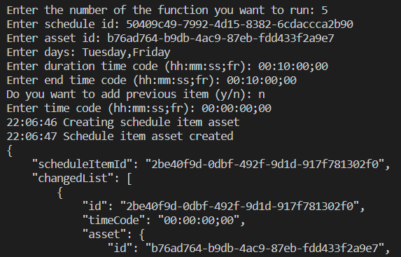

> 📘 Note
> 
> For more information about the API call used got to [Create Schedule Item Asset](https://developer.nomad-cms.com/docs/create-schedule-item-asset)

## Create Schedule Item Live Channel

To create a schedule item live channel, enter 6 when prompted. Then enter the id of the schedule you want to add the live channel to, the name(s) of the day(s) you want the item to span, the duration time code, which is the difference between the end time code and the time code, the end time code, the id of the channel, optionally the previous item id, and the time code.

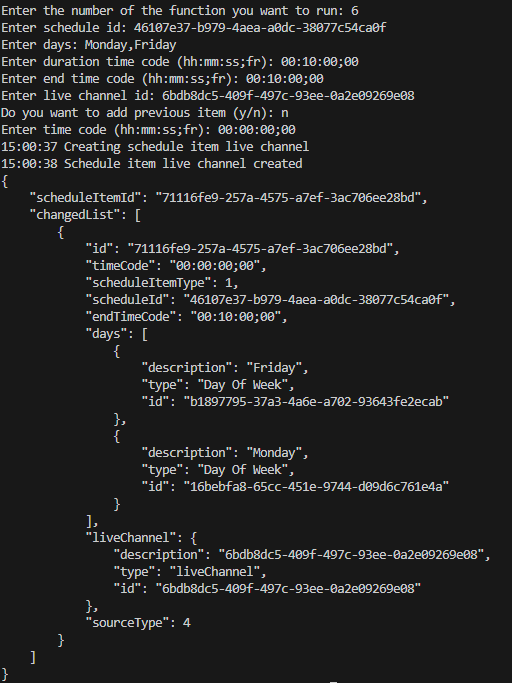

> 📘 Note
> 
> For more information about the API call used got to [Create Schedule Item Live Channel](https://developer.nomad-cms.com/docs/create-schedule-item-live-channel)

## Create Schedule Item Playlist Schedule

To create a schedule item playlist schedule, enter 7 when prompted. Then enter the id of the schedule you want to add the playlist schedule to, the name(s) of the day(s) you want the item to span, the duration time code, which is the difference between the end time code and the time code, the end time code, the id of the playlist schedule, optionally the previous item id, and the time code.

> 📘 Note
> 
> For more information about the API call used got to [Create Schedule Item Playlist Schedule](https://developer.nomad-cms.com/docs/create-schedule-item-playlist-schedule)

## Create Schedule Item Search Filter

To create a schedule item search filter, enter 8 when prompted. Then enter the id of the schedule you want to add the schedule item search filter to and the filter information you want to use.

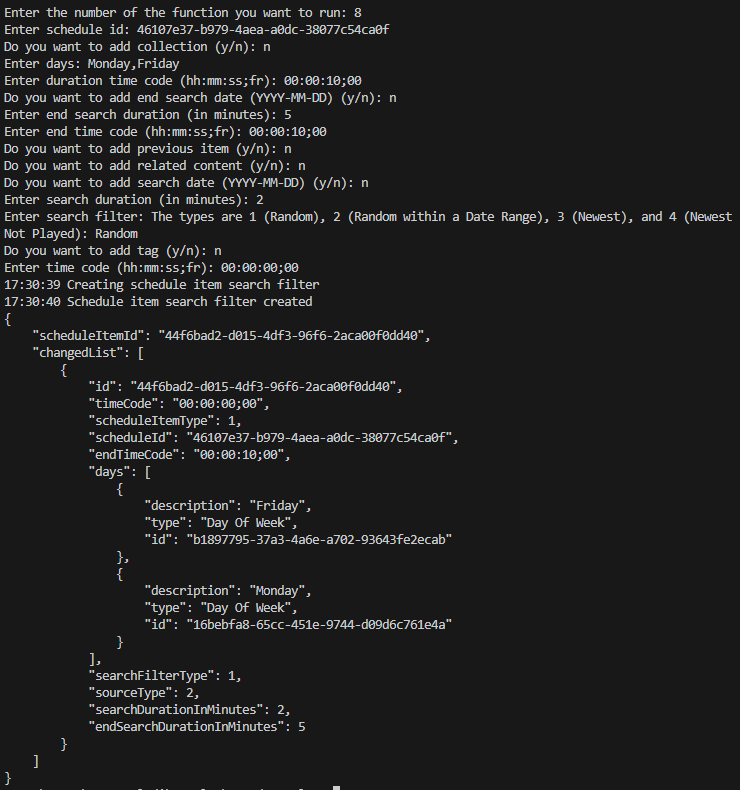

> 📘 Note
> 
> For more information about the API call used got to [Create Schedule Item Search Filter](https://developer.nomad-cms.com/docs/create-schedule-item-search-filter)

## Delete Intelligent Playlist

To delete an intelligent playlist, enter 9 when prompted. Then enter the id of the intelligent playlist you want to delete.

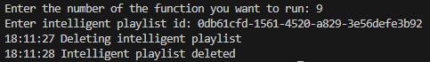

> 📘 Note)
> 
> For more information about the API call used got to [Delete Intelligent Playlist](https://developer.nomad-cms.com/docs/delete-intelligent-playlist)

## Delete Intelligent Schedule

To delete an intelligent schedule, enter 10 when prompted. Then enter the id of the intelligent schedule you want to delete.

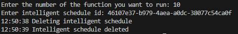

> 📘 Note
> 
> For more information about the API call used got to [Delete Intelligent Playlist](https://developer.nomad-cms.com/docs/delete-intelligent-schedule)

## Delete Playlist

To delete a playlist, enter 11 when prompted. Then enter the id of the playlist you want to delete.

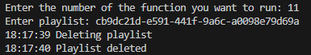

> 📘 Note
> 
> For more information about the API call used got to [Delete Playlist](https://developer.nomad-cms.com/docs/delete-playlist)

## Delete Schedule Item

To delete a schedule item, enter 12 when prompted. Then enter the id of the schedule the item is in and the id of the item you want to delete.

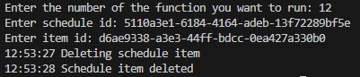

> 📘 Note
> 
> For more information about the API call used got to [Delete Schedule Item](https://developer.nomad-cms.com/docs/delete-schedule-item)

## Get Intelligent Playlist

To get an intelligent playlist, enter 13 when prompted. Then enter the id of the intelligent playlist you want to get.

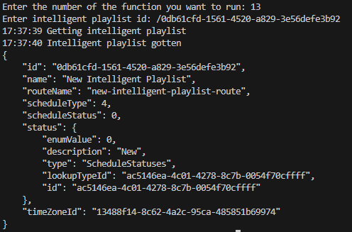

> 📘 Note
> 
> For more information about the API call used got to [Get Intelligent Playlist](https://developer.nomad-cms.com/docs/get-intelligent-playlist)

## Get Intelligent Schedule

To get an intelligent schedule, enter 14 when prompted. Then enter the id of the intelligent schedule you want to get.

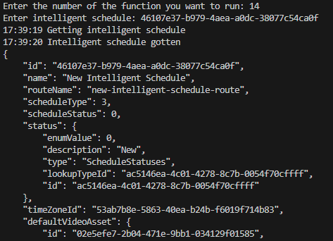

> 📘 Note
> 
> For more information about the API call used got to [Get Intelligent Schedule](https://developer.nomad-cms.com/docs/get-intelligent-schedule)

## Get Playlist

To get a playlist, enter 15 when prompted. Then enter the id of the playlist you want to get.

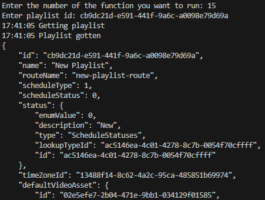

> 📘 Note
> 
> For more information about the API call used got to [Get Playlist](https://developer.nomad-cms.com/docs/get-playlist)

## Get Schedule Item

To get a schedule item, enter 16 when prompted. Then enter the id of the schedule the item is in and the the id of the item to get.

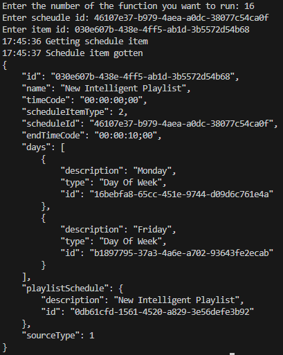

> 📘 Note
> 
> For more information about the API call used got to [Get Schedule Item](https://developer.nomad-cms.com/docs/get-schedule-item)

## Get Schedule Items

To get all schedule items, enter 17 when prompted. Then enter the id of the schedule you want to get the items from.

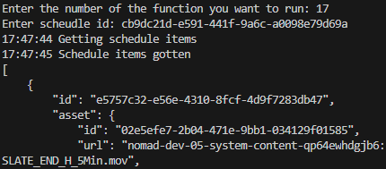

> 📘 Note
> 
> For more information about the API call used got to [Get Schedule Items](https://developer.nomad-cms.com/docs/get-schedule-items)

## Get Schedule Preview

To get a schedule preview, enter 18 when prompted. Then enter the id of the schedule you want to get the preview from.

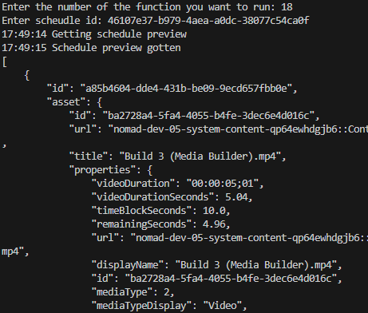

> 📘 Note
> 
> For more information about the API call used got to [Get Schedule Preview](https://developer.nomad-cms.com/docs/get-schedule-preview)

## Move Schedule Item

To move a schedule item, enter 19 when prompted. Then enter the id of the item you want to move and the id of the item you want to place the item after.

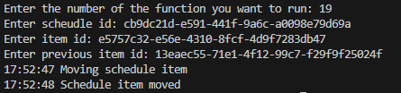

> 📘 Note
> 
> For more information about the API call used got to [Move Schedule Item](https://developer.nomad-cms.com/docs/move-schedule-item)

## Publish Intelligent Schedule

To publish an intelligent schedule, enter 20 when prompted. Then enter the id of the intelligent schedule you want to publish and the number of days you want the intelligent schedule to be locked for.

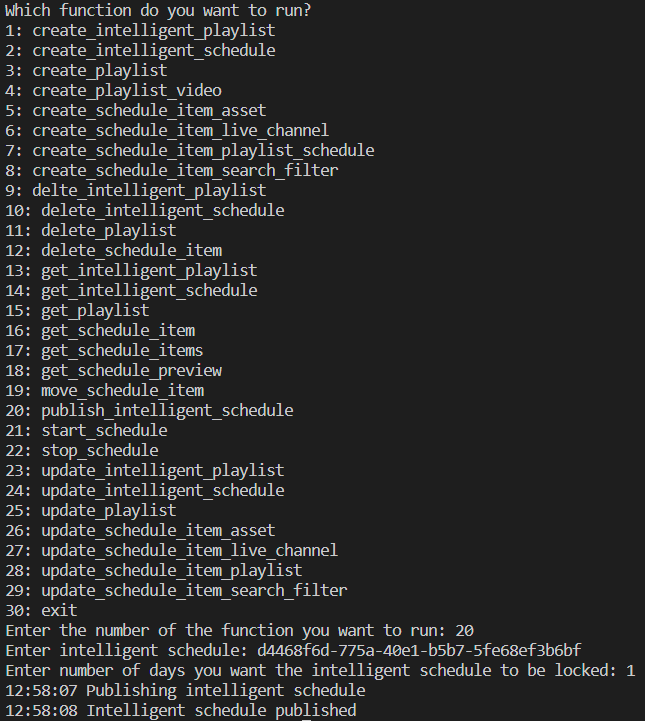   

> 📘 Note
> 
> For more information about the API call used got to [Publish Intelligent Schedule](https://developer.nomad-cms.com/docs/publish-intelligent-schedule)

## Start Schedule

To start a schedule, enter 21 when prompted. Then enter the id of the schedule you want to start and whether or not to skip cleanup on failure.

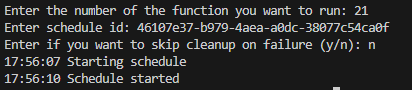

> 📘 Note
> 
> For more information about the API call used got to [Start Schedule](https://developer.nomad-cms.com/docs/start-schedule)

## Stop Schedule

To stop a schedule, enter 22 when prompted. Then enter the id of the schedule you want to stop and whether or not to force the stop.

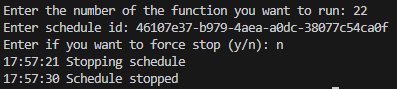

> 📘 Note
> 
> For more information about the API call used got to [Stop Schedule](https://developer.nomad-cms.com/docs/stop-schedule)

## Update Intelligent Playlist

To update an intelligent playlist, enter 23 when prompted. Then enter the id of the intelligent playlist you want to update and the information you want to update.

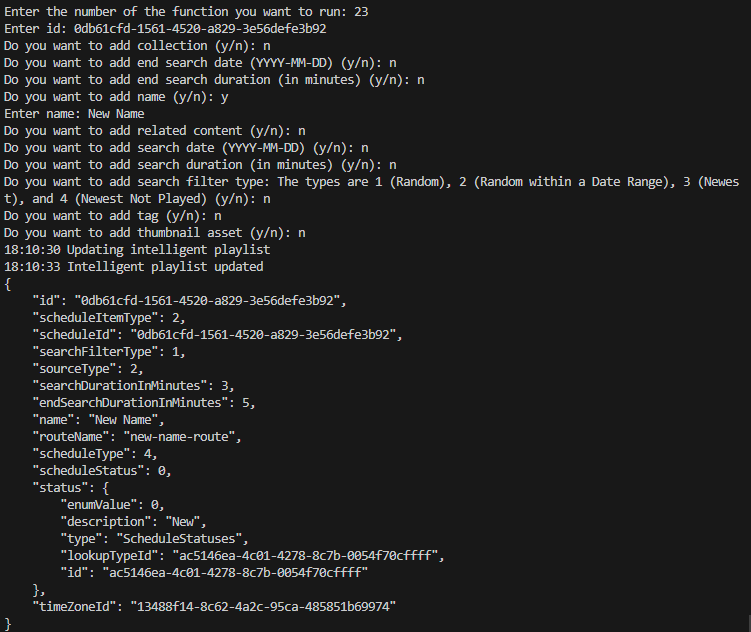

> 📘 Note
> 
> For more information about the API call used got to [Update Intelligent Playlist](https://developer.nomad-cms.com/docs/update-intelligent-playlist)

## Update Intelligent Schedule

To update an intelligent schedule, enter 24 when prompted. Then enter the id of the intelligent schedule you want to update and the the information to update.

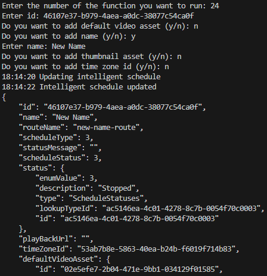

> 📘 Note
> 
> For more information about the API call used got to [Update Intelligent Schedule](https://developer.nomad-cms.com/docs/update-intelligent-schedule)

## Update Playlist

To update a playlist, enter 25 when prompted. Then enter the id of the playlist you want to update and the information to update.

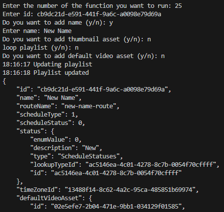

> 📘 Note
> 
> For more information about the API call used got to [Update Playlist](https://developer.nomad-cms.com/docs/update-playlist)

## Update Playlist Video

To update a playlist video, enter 30 when prompted. Then enter the id of the playlist the video is in and the id of the video you want to update. Then enter the asset information you want to update.

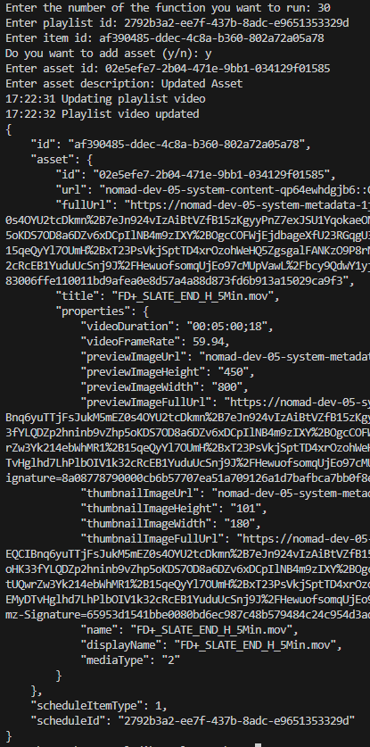

> 📘 Note
>
> For more information about the API call used got to [Update Playlist Video](https://developer.nomad-cms.com/docs/update-playlist-video)

## Update Schedule Item Asset

To update a schedule item asset, enter 26 when prompted. Then enter the id of the schedule the item is in and the id of the item you want to update. Then enter the information you want to update.

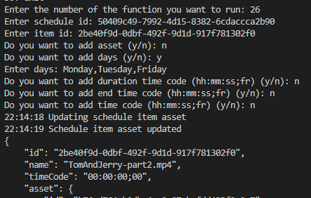

> 📘 Note
> 
> For more information about the API call used got to [Create Schedule Item Asset](https://developer.nomad-cms.com/docs/create-schedule-item-asset)

## Update Schedule Item Live Channel

To update a schedule item live channel, enter 27 when prompted. Then enter the id of the schedule the item is in and the id of the item you want to update. Then enter the information you want to update.

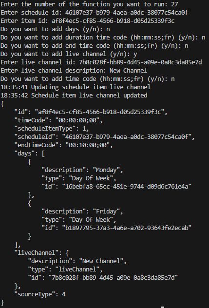

> 📘 Note
> 
> For more information about the API call used got to [Update Schedule Item Live Channel](https://developer.nomad-cms.com/docs/update-schedule-item-live-channel)

## Update Schedule Item Playlist Schedule

To update a schedule item playlist schedule, enter 28 when prompted. Then enter the id of the schedule the item is in and the id of the item you want to update. Then enter the information you want to update.

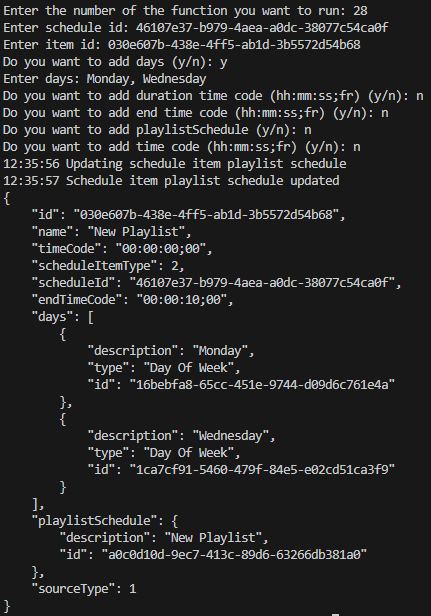

> 📘 Note
> 
> For more information about the API call used got to [Update Schedule Item Playlist Schedule](https://developer.nomad-cms.com/docs/update-schedule-item-playlist-schedule)

## Update Schedule Item Search Filter

To update a schedule item search filter, enter 29 when prompted. Then enter the id of the schedule the item is in and the id of the item you want to update. Then enter the information you want to update.

> 📘 Note
> 
> For more information about the API call used got to [Update Schedule Item Search Filter](https://developer.nomad-cms.com/docs/update-schedule-item-search-filter)