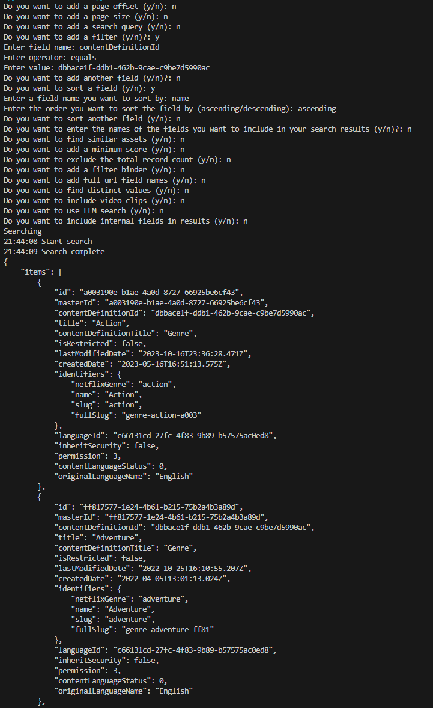

## Prerequisites

- Pip

> 📘 Note
> 
> You can download pip [here](https://pip.pypa.io/en/stable/installation/).

## Nomad SDK PIP

To learn how to download and setup the nomad sdk pip, go to [Nomad SDK PIP](https://github.com/Nomad-Media/nomad-sdk/tree/main/nomad-sdk-pip).

## Search

To search, enter the information in the parameters you want to use to search.

> 📘 Note
> 
> For more information about the API calls used go to [Search](https://developer.nomad-cms.com/docs/search-api)