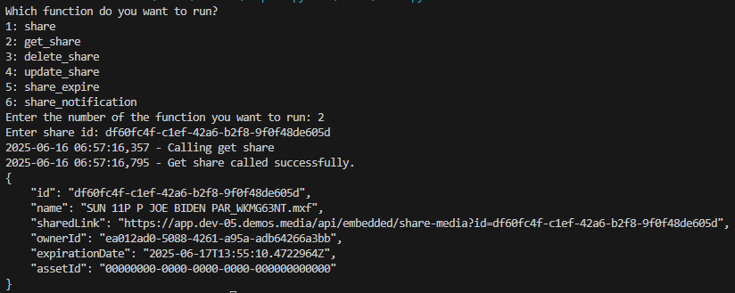
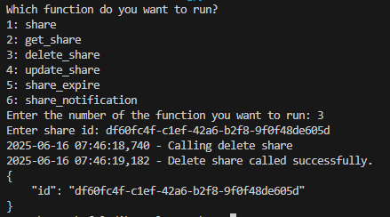

## Prerequisites

- Pip

> 📘 Note
> 
> You can download pip [here](https://pip.pypa.io/en/stable/installation/).

## Nomad SDK PIP

To learn how to download and setup the nomad sdk pip, go to [Nomad SDK PIP](https://github.com/Nomad-Media/nomad-sdk/tree/main/nomad-sdk-pip).

## Share

To share an asset, enter 1 when propmted. Then enter the id(s) of the asset(s) you want to share under shared content and the duration id under shared duration. Enter any additional information you want to add in the additional fields.

> 📘 Note
> 
> For more information about the API call used go to [Share](https://developer.nomad-cms.com/docs/share)

## Get Share

To get a share, enter 2 when prompted. Then enter the id of the share you want to get the information of.

> 📘 Note
> 
> For more information about the API call used go to [Get Share](https://developer.nomad-cms.com/docs/get-share)

## Delete Share

To delete a share, enter 3 when prompted. Then enter the id of the share you want to delete.

> 📘 Note
> 
> For more information about the API call used go to [Delete Share](https://developer.nomad-cms.com/docs/delete-share)

## Update Share

To update a share, enter 4 shen prompted. Then enter the id of the share you want to update along with the field(s) you want to update the share with.

> 📘 Note
> 
> For more information about the API call used go to [Update Share](https://developer.nomad-cms.com/docs/update-share)

## Share Expire

To expire a share, enter 5 when prompted. Then enter the id of the share you want to expire.

> 📘 Note
> 
> For more information about the API call used go to [Share Expire](https://developer.nomad-cms.com/docs/share-expire)

## Share Notification

To send a notifaction of a share to user(s), enter 6 when prompted. Then enter the id of the share, the id(s) of the nomad user(s) and/or the id(s) of the external user(s) you want to send the notification to.

> 📘 Note
> 
> For more information about the API call used go to [Share Notication](https://developer.nomad-cms.com/docs/share-notification)