# Prerequisites

- Pip

> 📘 Note
> 
> You can download pip [here](https://pip.pypa.io/en/stable/installation/).

## Nomad SDK PIP

To learn how to download and setup the nomad sdk pip, go to [Nomad SDK PIP](https://github.com/Nomad-Media/nomad-sdk/tree/main/nomad-sdk-pip).

# Content Definition Setup

## Introduction

For this walkthrough we are assuming you read and understand the concepts and terminology explained in [Content Definitions](doc:content-definitions).

## Creating the Movie content definition

Let's create a new content definition called Movie with the following fields and settings:

| Title | Type | Required | Is Index Identifier | Editor Form Fields Tab | Content List Fields Tab |
|-------|------|----------|---------------------|------------------------|------------------------|
| Title | Short Text | Yes | Yes | Yes | Yes |
| Slug | Short Text<br>Slugify | Yes | Yes | Yes | No |
| Plot | Long Text | No | Yes | Yes | Yes |
| Genres | Lookup Multi-Select | No | Yes | Yes | Yes |
| Tags | Lookup Multi-Select | No | Yes | Yes | Yes |
| Performers | Lookup Multi-Select | No | Yes | Yes | Yes |
| Ratings | Related Content Definition | No | Yesq | Yes | Yes |
| Release Date | Date | No | Yes | Yes | Yes |
| Image | Image Selector | No | Yes | Yes | Yes |
| Video | Asset Selector | No | Yes | Yes | Yes |

The completed Movie content definition will look like this:

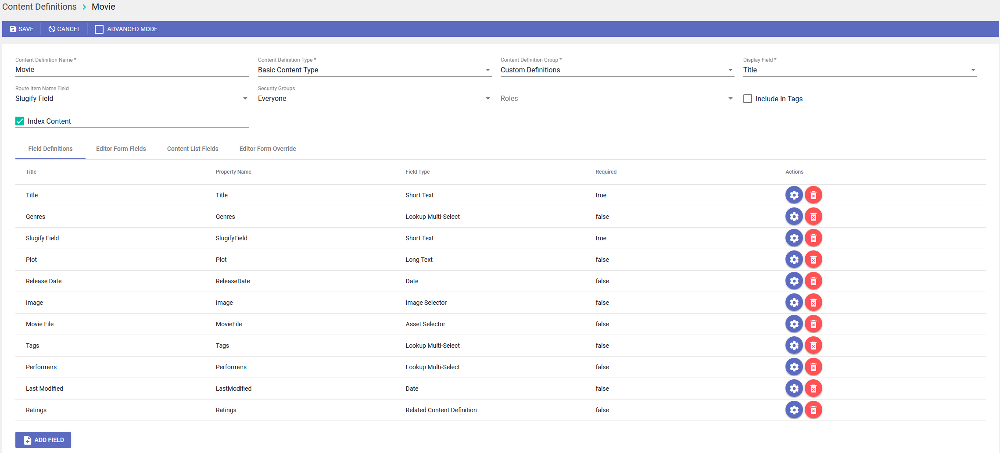

## Creating the Movie Genre content definition

Let's create another content definition to add more metadata to the asset for use in queries. This one will be a Movie Genre content definition.

| Title | Type | Required | Is Index Identifier | Editor Form Fields Tab | Content List Fields Tab |
|-------|------|----------|---------------------|------------------------|------------------------|
| Name | Short Text | Yes | Yes | Yes | Yes |
| Slug | Short Text<br>Slugify | Yes | Yes | Yes | No |

The completed Movie Genre content definition will look like this:

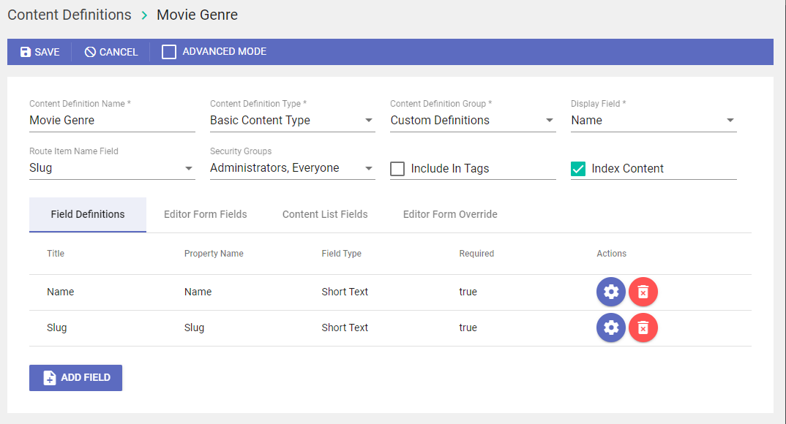

## Other Content Definitions

Here are the tables for the other Content Definitions:

Tags:

| Title | Type       | Required | Is Index Identifier | Editor Form Fields Tab | Content List Fields Tab |
| :---- | :--------- | :------- | :------------------ | :--------------------- | :---------------------- |
| Name  | Short Text | Yes      | Yes                 | Yes                    | Yes                     |

Performers:

| Title | Type | Required | Is Index Identifier | Editor Form Fields Tab | Content List Fields Tab |
|-------|------|----------|---------------------|------------------------|------------------------|
| Name | Short Text | Yes | Yes | Yes | Yes |
| Slug | Short Text<br>Slugify | Yes | Yes | Yes | No |

Ratings:

| Title | Type | Required | Is Index Identifier | Editor Form Fields Tab | Content List Fields Tab |
|-------|------|----------|---------------------|------------------------|------------------------|
| Name | Short Text | Yes | Yes | Yes | Yes |
| Slug | Short Text<br>Slugify | Yes | Yes | Yes | No |

# Code Overview
## Content Definitions

To run the code, you need to change the content definitions located at the top of the file. Replace that values to match the content definitions matching your environment.

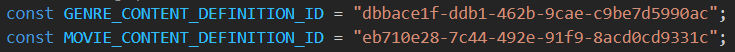

## Synchronize json file

Then to start synchronization run the code. The movie data in the json file will then synchronize. If the movies are not found in your content definition, they will be created. If they are found, but the values in the content definition are different than they are in the json file, the movie content will be updated with the new values form the json file. It will then check the delete_ids file and delete any ids in the file.

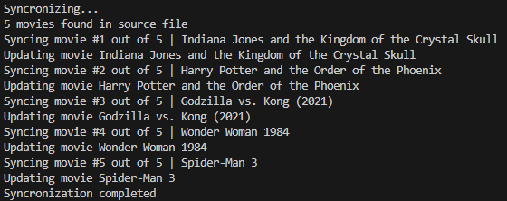

> 📘 Note
> 
> For more information about the API calls used go to [Search](ref:search-2) [Creates a content.](ref:createcontent) [Updates a content.](ref:updatecontent) [Deletes a content.](ref:deletecontent)

# Importing Movies Sample Content
## Introduction

In this walkthrough, we will be importing content definitions, content records, and assets into the Asset Manager. This walkthrough assumes you are already familiar with using the Asset Manager and have already read these guides:

- [Nomad's Asset Manager](doc:administering-cloud-content-with-nomads-asset-manager) 
- [Registration](doc:registration) 

## Step 1: Download the import file

Download the import file from this [link](https://download.nomad-cms.com/code-samples/nomad-import-movies.zip).

## Step 2: Create Import Folder

In the Asset Manager, you need to create an **Import** folder inside the **Content** folder. This will become the system default folder to look for import files.

- Make sure that in the main dropdown you have **Asset** selected.
- In the folders tree, click the three dots in the **Content** folder and click on **Add Folder**.
- In the **Add new Folder** dialog window, enter **Import** and click **Create**.

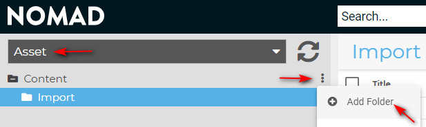

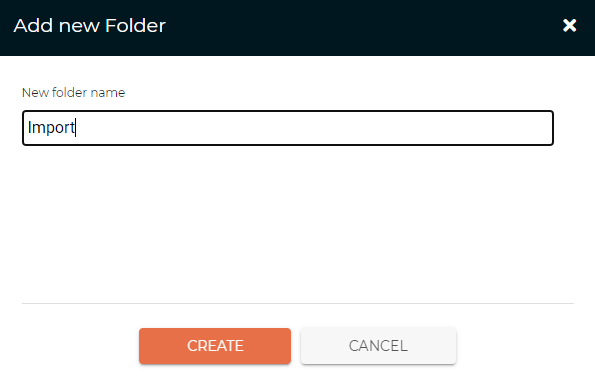

Now that the **Import** folder has been created, you are ready to continue with uploading the import file.

## Step 3: Upload the import file

In the Asset Manager, select the **Import** folder you just created. Then, on the top right corner, click **Upload** and from the dropdown menu select **File(s)**.

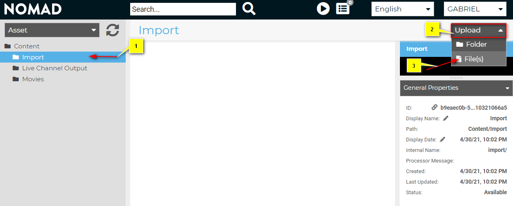

This will open the default file dialog window for your operating system.  
Then, navigate to the import file you downloaded in **[Step 1](https://developer.nomad-cms.com/docs/importing#step-1-download-the-import-file)**, select it and click the **Open** button to upload it.

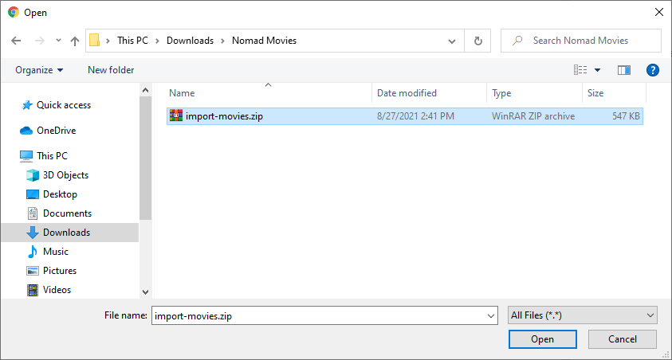

You should see the following "Uploading" dialog window. Once the upload is finished, the status will change to **COMPLETED** and you can close the dialog window.

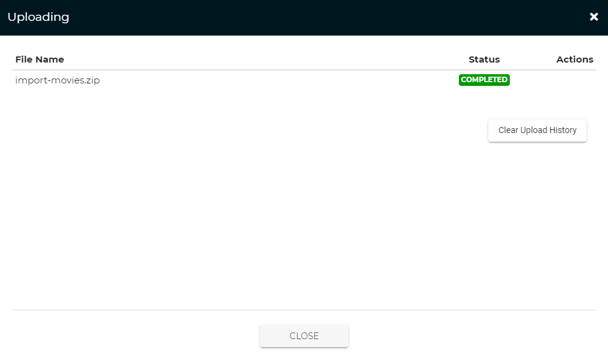

You should see the imported file in the Asset Manager listed in the contents of the Import folder as shown in the capture below:

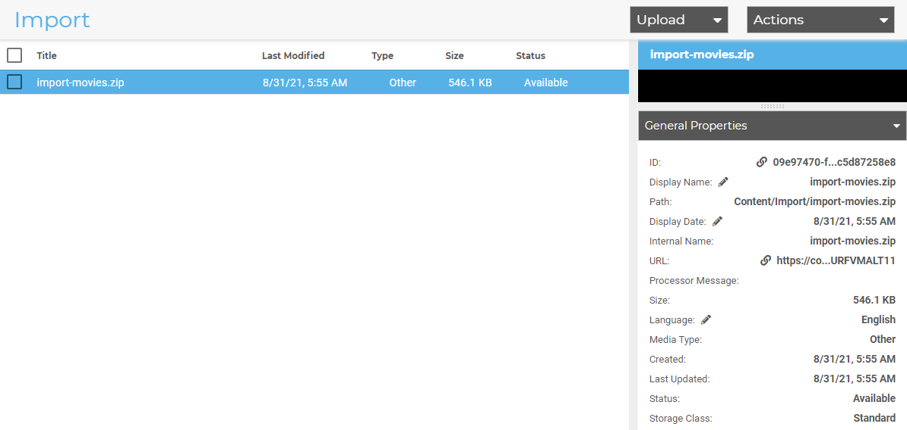

## Step 4: Import Archive

## IMPORT USING POSTMAN

If you are familiar with Postman, you can download this custom [Postman Collection JSON file](https://download.nomad-cms.com/code-samples/nomad-movie-postman-collection.json) and import it into any Workspace.

> 📘 Postman
> 
> You can get the latest free version of Postman for your OS [here](https://www.postman.com/downloads/).

Once you have downloaded the JSON file, open Postman, select or create a Workspace of you choice. Then in the **File** menu select **Import**, click the **Upload Files** button, navigate to where you saved the JSON file and open it.

This should have created a collection called **Nomad** with these two requests:

- Login
- Import Archive

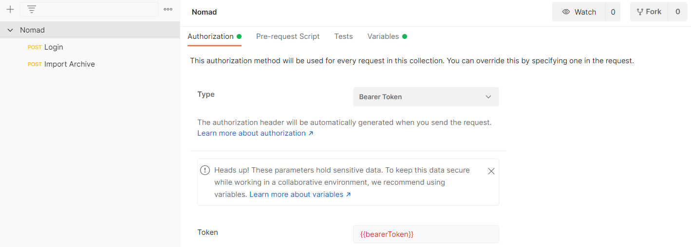

Before being able to send any of the two requests, you also need to set the following variables in the Postman **Variables** tab:

- client_id _(Provided to you by Nomad)\_
- username _(Set by you during registration process)_
- password _(Set by you during registration process)_

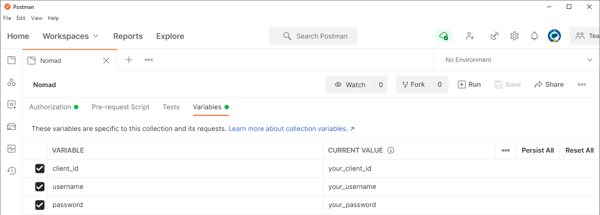

Now, with the variables properly set, you are ready to send the Import request to your Nomad instance with the following procedure:

- Send the Login request first and wait for a successful response where the Bearer Token gets set. 
- Send the Import Archive request and wait for a "200 OK" response after the import has been completed. Importing should take about one minute. 

## IMPORT USING cURL

You can also use cURL from a terminal, command or PowerShell console to POST these two requests using the following variables:

- client_id _(Provided to you by Nomad)\_
- username _(Set by you during registration process)_
- password _(Set by you during registration process)_
- bearerToken _(Obtained in the login response)_

## Login

```curl Login
curl --location --request POST 'https://admin-app.client_id.nomad-cms.com/api/account/login' \
--header 'Content-Type: application/json' \
--data-raw '{
    "username": "username",
    "password": "password"
}'
```

## Import Archive
```curl Import Archive
curl --location --request POST 'https://admin-app.client_id.nomad-cms.com/api/config/importArchive?fileName=import-movie.zip&runLocal=true' \
--header 'Authorization: Bearer bearerToken'
```