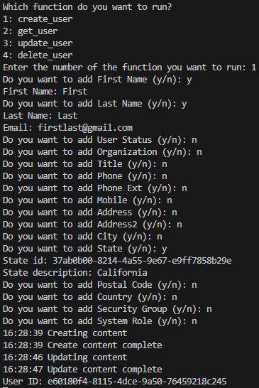
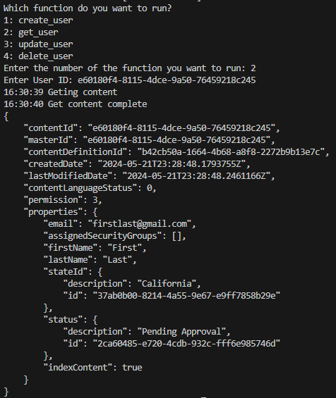
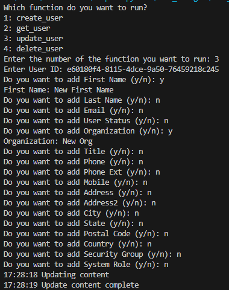
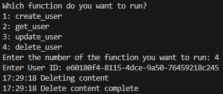

## Prerequisites

- Pip

> 📘 Note
> 
> You can download pip [here](https://pip.pypa.io/en/stable/installation/).

## Nomad SDK PIP

To learn how to download and setup the nomad sdk pip, go to [Nomad SDK PIP](https://github.com/Nomad-Media/nomad-sdk/tree/main/nomad-sdk-pip).

## Create User

To create a user, enter 1. Then enter the user's properties.

> 📘 Note
>
> For more information about the API call used got to [Create Content](https://developer.nomad-cms.com/docs/create-content)

## Get User

To get a user, enter 2. Then enter the user's id.

> 📘 Note
>
> For more information about the API call used got to [Get Content](https://developer.nomad-cms.com/docs/get-content)

## Update User

To update a user, enter 3. Then enter the user's id and the properties you want to update.

> 📘 Note
>
> For more information about the API call used got to [Update Content](https://developer.nomad-cms.com/docs/update-content)

## Delete User

To delete a user, enter 4. Then enter the user's id.

> 📘 Note
>
> For more information about the API call used got to [Delete Content](https://developer.nomad-cms.com/docs/delete-content)