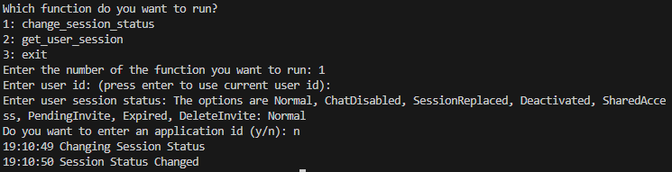

## Prerequisites

- Pip

> 📘 Note
> 
> You can download pip [here](https://pip.pypa.io/en/stable/installation/).

## Nomad SDK PIP

To learn how to download and setup the nomad sdk pip, go to [Nomad SDK PIP](doc:nomad-sdk-pip).

## Change Session Status

To change the session status of a user input 1 to select the change_status function. Then enter the user session status you want to change to.

> 📘 Notes:
> 
> For more information about the API calls used go to [Changes a session status.](ref:changesessionstatus)