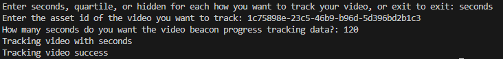
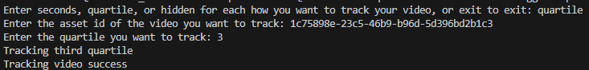
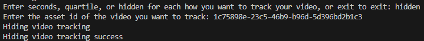

## Prerequisites

- Pip

> 📘 Note
> 
> You can download pip [here](https://pip.pypa.io/en/stable/installation/).

## Nomad SDK PIP

To learn how to download and setup the nomad sdk pip, go to [Nomad SDK PIP](https://github.com/Nomad-Media/nomad-sdk/tree/main/nomad-sdk-pip).

## Video Tracking Seconds

To send the tracking data for the current seconds in the video player, enter seconds. Then enter the asset id for the video the user is watching you want to track and the number of seconds you want to use for how often to send the video beacon progress tracking data.

## Video Tracking Quartile

To send the tracking data for the quartile in the video player for the current asset the user is watching, enter quartile. Then enter the asset id of the video the user is watching, the quartile you want to track under tracking events.

## Video Tracking Hidden

To hide a user's video tracking data, enter hidden. Then enter the asset id for the video they want removed from their watch-list.

> 📘 Note
> 
> For more information about the API calls used got to [Video Tracking Service API](doc:video-tracking-service-api)